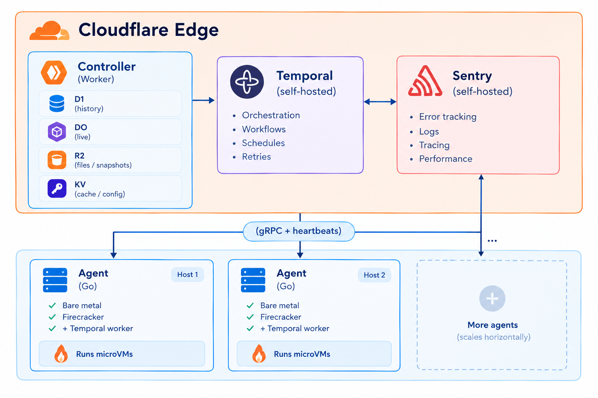

# PukuCloud

## 1. What is PukuCloud, and how is it built?

PukuCloud is an open-source control plane + scheduler for **Firecracker microVMs**, shipping two products on the same engine:

- **Disposable sandboxes** for AI agents and untrusted code — sub-second boot from baked snapshots, full lifecycle (create / exec / pause / resume / hibernate / fork / snapshot / TTL).
- **Managed PostgreSQL 16 databases** — a real durable database in its own microVM, with a native `postgres://` URL, continuous WAL archiving, and restore-to-latest failover.

Both products share the same fleet, scheduler, and snapshot pipeline. There is no separate "agent" for databases vs sandboxes — they are just different templates over the same microVM substrate.

### Design goals

- **No PostgreSQL anywhere in the project.** All structured state (sandboxes, databases, templates, audit log, tokens, orgs) lives in **Cloudflare D1** (SQLite at the edge).
- **Scalable by adding hosts.** The scheduler is stateless — drop another bare-metal KVM host into the fleet and Temporal routes work to it.
- **Observable end-to-end.** Every failure is captured (Sentry) and every long-running operation is durable (Temporal), so nothing is lost when a worker crashes.
- **Bring-your-own auth.** Stub mode for local dev, JWT verification against any JWKS endpoint (Supabase, Auth0, etc.) for production.

### Architecture (after the refactor)



### How each piece is built

| Layer | Component | Tech | Lives in |
|---|---|---|---|
| **Control plane** | HTTP API, scheduler, auth, JWT verification, token mgmt, D1 queries, DO reads, audit log writes, Temporal client | TypeScript on Cloudflare Workers, Hono router | `workers/` |
| **Live state** | Per-agent state (status, current VM, CPU/mem capacity, last-seen), strong consistency, write-through from heartbeats | Cloudflare Durable Object (`WorkerStateDO`) indexed by D1 `worker_manifest` table | `workers/src/durable/` |
| **Durable history** | Sandboxes, databases, templates, snapshots, tokens, orgs, audit log | Cloudflare D1 (SQLite), migrations in `workers/migrations/` | `workers/migrations/0001_*.sql` … `0006_*.sql` |
| **Workflow orchestration** | Launch / pause / resume / snapshot / delete / failover workflows; activity heartbeat retries; durable timers | Temporal (self-hosted), workflows + activities in Go | `agent/internal/temporal/` |
| **Error monitoring** | Capture exceptions + transactions from controller and agents, project split (`pukucloud-controller`, `pukucloud-agent`) | Self-hosted Sentry (Docker Compose) | `infra/sentry/` |
| **microVM host** | Firecracker lifecycle, vsock guest wire, UFFD memory streaming from R2, NBD rootfs streaming, snapshot store, network namespaces | Go binary, one per KVM host, registered as a Temporal worker | `agent/` |
| **Guest agent (in-VM)** | exec, REPL, LSP, MCP, filesystem, ports, proxy | Talks to host over vsock | `agent/internal/guest/` |
| **Database proxy** | SNI-routing `*.db.<zone>` → DB microVM | Go, deploys per-zone | `db-proxy/` |
| **Dashboard** | Sandboxes, databases, templates, workers, audit log | Next.js 16 (App Router), Supabase auth, polling REST | `dashboard/` |
| **CLI** | `pukucloud` stdlib-only Go CLI for scripting | | `cmd/pukucloud/` |
| **Object storage** | Snapshot seeds, UFFD memory pages, rootfs pages | Cloudflare R2 (or GCS adapter) | Wrangler binding |

### What lives where (repo layout)

| Path | Purpose |
|---|---|
| `agent/` | Per-host Firecracker microVM agent (Go) — Temporal worker, host supervisor, sandbox manager. |
| `workers/` | Cloudflare Workers control plane (TypeScript + D1 + R2 + KV + DO + Hono). |
| `dashboard/` | Next.js web dashboard. |
| `db-proxy/` | SNI-routing Postgres proxy. |
| `cmd/pukucloud/` | CLI. |
| `templates/` | microVM template Dockerfiles (`base`, `code-interpreter`, `agent`, `postgres-16`). |
| `infra/temporal/` | Self-hosted Temporal (docker-compose + prod TLS overlay). |
| `infra/sentry/` | Self-hosted Sentry. |
| `infra/terraform/` | AWS + GCP multi-node Terraform envs. |
| `docs/` | GitHub-rendered docs (architecture, runbooks, setup guides). |
| `scripts/` | Local dev helpers (`mac-local-e2e.sh`, `linux-local-e2e.sh`, `bake-templates.sh`). |

---

## 2. Full manual run guide — every step, every endpoint

This is the **single ordered path** to bring up a working PukuCloud on your machine or in a small cloud account. Times are rough estimates.

### Prerequisites

- A Cloudflare account (free tier is fine for dev).
- One or more Linux hosts with `/dev/kvm` exposed (bare-metal, `*.metal`, or a KVM-capable cloud VM).
- `docker` + `docker compose` on the host that runs Temporal / Sentry.
- `wrangler` (`npm i -g wrangler`) authenticated against your Cloudflare account.
- `go` 1.22+, `node` 20+, `jq`.

### Step 1 — Bring up Temporal (≈ 5 min)

```bash
cd infra/temporal
docker compose up -d
# Wait for the healthcheck
curl -fsS http://localhost:8233/health
# → {"status":"SERVING"}
```

If running on a remote host, expose **7233 (gRPC)** and **8233 (HTTP API)** behind TLS. The prod overlay (`docker-compose.prod.yml`) wires in `TEMPORAL_TLS`, `TEMPORAL_AUTH_ENABLED`, mounted certs at `/etc/temporal/certs`, and `TEMPORAL_AUTH_TOKEN` / `TEMPORAL_SERVER_NAME` env vars.

Verify:

```bash
# from the Temporal host
docker compose ps                 # pukucloud-temporal: healthy
curl -fsS http://localhost:8233/health
```

### Step 2 — Bring up Sentry (≈ 5 min)

```bash
cd infra/sentry
docker compose up -d
# Open http://localhost:9000 and run the bootstrap wizard.
# Create two projects:
#   1. "pukucloud-controller" — language: Node
#   2. "pukucloud-agent"      — language: Go
# Copy each project's DSN. You'll paste them into secrets in Step 4.
```

The compose file already wires SMTP env vars (`SENTRY_EMAIL_HOST`, `_PORT`, `_USER`, `_PASSWORD`, `_FROM`, `_USE_TLS`) — replace those with your real relay/transport before going live.

### Step 3 — Provision Cloudflare resources (≈ 2 min)

```bash
cd workers
wrangler d1 create pukucloud-db        # copy ID → wrangler.toml
wrangler kv:namespace create CACHE     # copy ID → wrangler.toml
wrangler r2 bucket create pukucloud-snapshots   # for snapshot seeds + UFFD pages
```

Edit `workers/wrangler.toml` and paste the IDs into the `[env.production]` block.

Apply migrations:

```bash
wrangler d1 migrations apply pukucloud-db --remote
```

### Step 4 — Set Cloudflare Worker secrets (≈ 2 min)

From the `workers/` directory:

```bash
wrangler secret put TEMPORAL_ADDRESS         # e.g. https://temporal.your-domain.tld:8233
wrangler secret put SENTRY_DSN               # controller project DSN from Step 2
wrangler secret put PUKUCLOUD_AGENT_TOKEN    # shared with agents; openssl rand -hex 32
wrangler secret put PUKUCLOUD_ADMIN_TOKEN    # bootstrap admin token; openssl rand -hex 32
wrangler secret put SUPABASE_JWKS_URL        # leave blank for stub auth (dev only)
```

Verify:

```bash
wrangler secret list
```

### Step 5 — Deploy the controller (≈ 1 min)

```bash
wrangler deploy
# Output ends with: "Published pukucloud-api (X.XX sec)"
# Note your URL: https://pukucloud-api.<your-account>.workers.dev
```

Sanity:

```bash
curl -fsS https://pukucloud-api.<your-account>.workers.dev/healthz
# → "ok"
curl -fsS https://pukucloud-api.<your-account>.workers.dev/version
# → { "name": "pukucloud-workers", "version": "..." }
```

### Step 6 — Boot an agent on bare-metal (≈ 2 min per host)

On a Linux host with `/dev/kvm`:

```bash
# 1. Get the binary
curl -L https://github.com/yourorg/pukucloud/releases/latest/download/agent-linux-amd64 \
  -o /usr/local/bin/agent && chmod +x /usr/local/bin/agent

# 2. Env file (sourced by the systemd unit)
sudo mkdir -p /etc/pukucloud
sudo tee /etc/pukucloud/agent.env >/dev/null <<'EOF'
TEMPORAL_ADDRESS=temporal.your-domain.tld:7233
TEMPORAL_NAMESPACE=default
TEMPORAL_TASK_QUEUE=pukucloud-microvms
SENTRY_DSN=https://abc123@sentry.your-domain.tld/1
PUKUCLOUD_WORKER_ID=host-1
PUKUCLOUD_REGION=us-east-1
PUKUCLOUD_ENV=production
PUKUCLOUD_CONTROLLER_URL=https://pukucloud-api.<your-account>.workers.dev
PUKUCLOUD_AGENT_TOKEN=<paste the same value as wrangler secret put PUKUCLOUD_AGENT_TOKEN>
EOF
sudo chmod 600 /etc/pukucloud/agent.env

# 3. systemd unit
sudo tee /etc/systemd/system/pukucloud-agent.service >/dev/null <<'EOF'
[Unit]
Description=PukuCloud Agent
After=network-online.target
Wants=network-online.target

[Service]
Type=simple
EnvironmentFile=/etc/pukucloud/agent.env
ExecStart=/usr/local/bin/agent
Restart=always
RestartSec=5
LimitNOFILE=65536

[Install]
WantedBy=multi-user.target
EOF

sudo systemctl daemon-reload
sudo systemctl enable --now pukucloud-agent
sudo systemctl status pukucloud-agent
# Look for: "temporal worker registered"
```

The agent begins posting heartbeats to the controller at `PUKUCLOUD_CONTROLLER_URL/v1/internal/agents/{worker_id}/state` every 10 seconds. The controller upserts the row into the `worker_manifest` D1 table and writes the live state into the `WorkerStateDO`. The dashboard's `/workers` page reads from there.

### Step 7 — Build templates (≈ 10 min, one-time per template)

```bash
# On a build host (doesn't have to be a running agent)
cd scripts
./bake-templates.sh base code-interpreter agent postgres-16
# Uploads to your configured registry; templates become available via GET /v1/templates
```

### Step 8 — Deploy the dashboard (≈ 3 min)

```bash
cd dashboard
npm install
npm run build
# Deploy to your hosting of choice (Vercel, Cloudflare Pages, or run with `npm start`)
```

Set the dashboard's `NEXT_PUBLIC_PUKUCLOUD_API` to your controller URL at build time.

### Step 9 — End-to-end verification

```bash
TOKEN="<paste admin token from Step 4>"

# Health
curl -fsS https://pukucloud-api.<your-account>.workers.dev/healthz

# List workers (heartbeats from Step 6 should appear within ~10 s)
curl -fsS https://pukucloud-api.<your-account>.workers.dev/v1/workers \
  -H "Authorization: Bearer $TOKEN" | jq

# Create a sandbox
SBX=$(curl -sS -X POST https://pukucloud-api.<your-account>.workers.dev/v1/sandboxes \
  -H "Authorization: Bearer $TOKEN" \
  -H 'Content-Type: application/json' \
  -d '{"template":"base"}' | jq -r .id)
echo "Sandbox: $SBX"

# Exec a command
curl -sS "https://pukucloud-api.<your-account>.workers.dev/v1/sandboxes/$SBX/exec" \
  -H "Authorization: Bearer $TOKEN" \
  -H 'Content-Type: application/json' \
  -d '{"cmd":"uname","args":["-a"]}'

# Delete it
curl -sS -X DELETE "https://pukucloud-api.<your-account>.workers.dev/v1/sandboxes/$SBX" \
  -H "Authorization: Bearer $TOKEN"
```

Open the Temporal UI at `http://temporal.your-domain.tld:8080` — you'll see the workflow transition `queued → running → completed` within ~30 s. Open Sentry at `http://sentry.your-domain.tld:9000` — you'll see a `LaunchMicroVMWorkflow` transaction with no errors.

### Adding more agents

Repeat Step 6 on each new host with a **different** `PUKUCLOUD_WORKER_ID`. Temporal routes new workflows to whichever agent has capacity; the controller sees them appear in `/v1/workers` within ~10 s.

### Rolling back

```bash
wrangler rollback                                # revert controller to previous deploy
ssh agent-host-1 systemctl stop pukucloud-agent  # drain an agent gracefully
cd infra/temporal && docker compose down -v      # tear down Temporal (only if sure)
cd infra/sentry   && docker compose down -v      # tear down Sentry (only if sure)
```

### Full endpoint reference

All endpoints live under `${PUKUCLOUD_API}/v1`. Sandbox, database, template, snapshot, and token endpoints require `Authorization: Bearer ${PUKUCLOUD_API_KEY}`. Internal agent endpoints require `Authorization: Bearer ${PUKUCLOUD_AGENT_TOKEN}` and are only reachable from the controller.

#### Health

| Method | Path | Auth | Description |
|---|---|---|---|
| GET | `/healthz` | none | Process liveness. Always 200 if the Worker is up. |
| GET | `/readyz` | none | Pings D1 + lists workers. 503 with `{degraded:[...]}` if down. |
| GET | `/version` | none | Runtime info (commit, build time). |

#### Auth / identity

| Method | Path | Auth | Description |
|---|---|---|---|
| GET | `/me` | bearer | Current user + orgs. |
| POST | `/me/current-org` | bearer | Switch active org. Body `{org_id}`. |
| GET | `/me/tokens` | bearer | List API tokens. |
| POST | `/me/tokens` | bearer | Mint a new token. Body `{label}`. |
| DELETE | `/me/tokens/:prefix` | bearer | Revoke a token. |

#### Sandboxes

| Method | Path | Auth | Description |
|---|---|---|---|
| GET | `/sandboxes` | bearer | List sandboxes for current org. |
| GET | `/sandboxes/:id` | bearer | Sandbox detail. |
| POST | `/sandboxes` | bearer | Create. Body `{template, from_snapshot?, ttl_seconds?}`. |
| DELETE | `/sandboxes/:id` | bearer | Tear down + delete. |
| POST | `/sandboxes/:id/pause` | bearer | Pause (snapshot memory, stop VM). |
| POST | `/sandboxes/:id/resume` | bearer | Resume from snapshot. |
| POST | `/sandboxes/:id/hibernate` | bearer | Hibernate (snapshot + free host resources). |
| POST | `/sandboxes/:id/wake` | bearer | Wake a hibernated sandbox. |
| POST | `/sandboxes/:id/stop` | bearer | Stop (alias for hibernate). |
| POST | `/sandboxes/:id/start` | bearer | Start (alias for wake). |
| POST | `/sandboxes/:id/snapshots` | bearer | Create a snapshot. Returns `{id, sandbox_id, created_at}`. |
| POST | `/sandboxes/:id/fork` | bearer | Fork N children. Body `{count}`. |
| POST | `/sandboxes/:id/exec` | bearer | Run a command. Body `{cmd, args?}`. |
| GET | `/sandboxes/:id/logs` | bearer | Recent logs (`?follow=1` for SSE). |
| GET | `/sandboxes/:id/metrics` | bearer | Live CPU/RSS/threads. |
| GET | `/sandboxes/:id/fs?path=...` | bearer | Read a file. |
| PUT | `/sandboxes/:id/fs?path=...` | bearer | Write a file. Body raw bytes. |
| DELETE | `/sandboxes/:id/fs?path=...` | bearer | Delete a path. |
| GET | `/sandboxes/:id/fs/dir?path=...` | bearer | List a directory. |
| GET | `/sandboxes/:id/ports` | bearer | List registered/detected ports. |
| POST | `/sandboxes/:id/ports` | bearer | Register a port. Body `{port, label?}`. |
| DELETE | `/sandboxes/:id/ports/:port` | bearer | Remove a registration. |
| GET | `/sandboxes/:id/proxy/:port/*` | bearer | Proxy an HTTP request through the guest. |

#### Snapshots

| Method | Path | Auth | Description |
|---|---|---|---|
| GET | `/snapshots` | bearer | List all snapshots in the org. |
| DELETE | `/snapshots/:id` | bearer | Delete a snapshot. |

#### Databases (managed Postgres)

| Method | Path | Auth | Description |
|---|---|---|---|
| GET | `/databases` | bearer | List databases. |
| GET | `/databases/:id` | bearer | Database detail (status, host, URL, credentials). |
| POST | `/databases` | bearer | Create. Body `{cpu?, memory_mb?, label?, always_on?}`. |
| PATCH | `/databases/:id` | bearer | Patch (currently `{always_on}`). |
| DELETE | `/databases/:id` | bearer | Destroy. |
| GET | `/databases/:id/stats` | bearer | Live stats (version, size, connections, uptime, cache hit, disk). |
| GET | `/databases/:id/logs?lines=300` | bearer | Tail Postgres logs. |
| GET | `/databases/:id/metrics?range=24h&bucket=5m` | bearer | Historical CPU/mem/net/disk. |
| POST | `/databases/:id/failover` | bearer | Restore-to-latest failover. |
| POST | `/databases/:id/wake` | bearer | Wake an idle (auto-suspended) DB. |
| POST | `/databases/:id/reset-credentials` | bearer | Rotate password + URL. |

#### Templates & volumes

| Method | Path | Auth | Description |
|---|---|---|---|
| GET | `/templates` | bearer | List templates. |
| DELETE | `/templates/:name` | bearer | Delete a custom template. |
| POST | `/templates/build` | bearer | Multipart upload (`name, size_mb, cpu, memory_mb, rootfs`). |
| GET | `/templates/builds` | bearer | List build jobs. |
| GET | `/templates/builds/:id` | bearer | Build status. |
| GET | `/volumes` | bearer | List volumes. |
| POST | `/volumes` | bearer | Create a volume. Body `{name, size_mb}`. |
| DELETE | `/volumes/:name` | bearer | Delete a volume. |

#### Orgs & members

| Method | Path | Auth | Description |
|---|---|---|---|
| GET | `/orgs` | bearer | List orgs for current user. |
| POST | `/orgs` | bearer | Create an org. Body `{name, slug}`. |
| GET | `/orgs/:id/members` | bearer | List members. |
| POST | `/orgs/:id/members` | bearer | Invite. Body `{email, role: "admin"\|"member"}`. |
| DELETE | `/orgs/:id/members/:user_id` | bearer | Remove. |
| POST | `/orgs/invites/:token/accept` | bearer | Accept an invite. |

#### Metrics

| Method | Path | Auth | Description |
|---|---|---|---|
| GET | `/metrics/overview?from=&to=&step=` | bearer | Fleet-wide series. |
| GET | `/metrics/sandbox/:id?from=&to=&step=` | bearer | Per-sandbox series. |

#### Workers (live state)

| Method | Path | Auth | Description |
|---|---|---|---|
| GET | `/v1/workers` | bearer | List all registered agents with live state from DOs. |
| GET | `/v1/workers/:worker_id` | bearer | One agent's live state. |
| POST | `/v1/internal/agents/:worker_id/state` | **agent** | Heartbeat from agent. Body `{status, current_vm_id, capacity, version}`. Upserts `worker_manifest` + writes DO. |
| GET | `/v1/internal/agents/:worker_id/state` | **agent** | Read own state (used by agents on startup). |

`step` for metrics is one of `"15s" | "1m" | "5m" | "1h"`. `range` for database metrics is one of `"1h" | "24h" | "7d" | "30d"`.

---

## 3. Unfinished parts and what to fill for a full production deploy

This section is the master checklist of placeholders that the in-repo example values leave open. Every box here **must** be filled before a non-local deploy. Local dev can ignore it (it uses `pds_local_dev_token`, `localhost:8080`, etc.).

### 🔴 Must replace before any non-local deploy

| Where | Placeholder | What to put |
|---|---|---|
| `infra/sentry/docker-compose.yml` (× 3) | `REPLACE_WITH_openssl_rand_hex_32` | `openssl rand -hex 32`. Same value in all 3 places. |
| `docker-compose.yml` (× 3) | `${SENTRY_SECRET_KEY:-REPLACE_WITH_openssl_rand_hex_32}` | Same, or set `SENTRY_SECRET_KEY` in shell env. |
| `docker-compose.dev.yml` (× 2) | `${SENTRY_SECRET_KEY:-REPLACE_WITH_openssl_rand_hex_32}` | Same. |
| `workers/wrangler.toml` (env.production) | `database_id = "REPLACE_WITH_D1_ID"` | `wrangler d1 create pukucloud-db` output. |
| `workers/wrangler.toml` (env.production) | `id = "REPLACE_WITH_KV_ID"` | `wrangler kv:namespace create CACHE` output. |
| `workers/wrangler.toml` (env.production) | `PUKUCLOUD_AGENT_URLS` | Comma-separated real agent hostnames/IPs (`https://agent-1...:9090,...`). Use `http://` if not terminating TLS in front. |
| `workers/wrangler.toml` (env.production) | `PUKUCLOUD_DASHBOARD_URL` | The public URL of the dashboard. |
| `infra/sentry/docker-compose.yml` | `SENTRY_EMAIL_HOST`, `_PORT`, `_USER`, `_PASSWORD`, `_FROM`, `_USE_TLS` | Real SMTP relay (Mailgun, SES, Postmark, etc.). |
| `workers/wrangler.toml` (env.staging) | same D1/KV/URL placeholders, for staging | Real staging values, or delete the block if you only deploy once. |

### 🟡 Set as environment variables on each bare-metal agent host

The agent reads these at boot. Put them in `/etc/pukucloud/agent.env` (sourced by the systemd unit).

| Variable | Example | Notes |
|---|---|---|
| `TEMPORAL_ADDRESS` | `temporal.your-domain.tld:7233` | gRPC frontend of your Temporal. |
| `TEMPORAL_NAMESPACE` | `default` | Match what the controller uses. |
| `TEMPORAL_TASK_QUEUE` | `pukucloud-microvms` | Match what the controller uses. |
| `TEMPORAL_AUTH_TOKEN` | (only if Temporal auth enabled) | Same secret used by controller. |
| `SENTRY_DSN` | `https://abc123@sentry.your-domain.tld/1` | From the `pukucloud-agent` project in Sentry. |
| `PUKUCLOUD_WORKER_ID` | `host-1` | **Unique per agent.** |
| `PUKUCLOUD_REGION` | `us-east-1` | Used for dashboard grouping + D1 writes. |
| `PUKUCLOUD_ENV` | `production` | One of `production`, `staging`, `development`. |
| `PUKUCLOUD_CONTROLLER_URL` | `https://pukucloud-api.<account>.workers.dev` | Where to POST heartbeats. |
| `PUKUCLOUD_AGENT_TOKEN` | `openssl rand -hex 32` | **Must match** the controller secret `PUKUCLOUD_AGENT_TOKEN`. |

### 🟡 Set as Cloudflare Worker secrets

Run from `workers/`. Each prompts you to paste the value.

```bash
wrangler secret put TEMPORAL_ADDRESS         # https://temporal.your-domain.tld:8233
wrangler secret put SENTRY_DSN               # controller project's DSN
wrangler secret put TEMPORAL_AUTH_TOKEN      # only if Temporal auth is enabled
wrangler secret put PUKUCLOUD_AGENT_TOKEN    # shared with all agents
wrangler secret put PUKUCLOUD_ADMIN_TOKEN    # bootstrap admin token
wrangler secret put SUPABASE_JWKS_URL        # leave blank for stub auth (dev only)
```

Verify with `wrangler secret list`.

### 🟢 TLS / DNS you provision (operator-fitted — not in any file)

These don't live in the repo at all; they come from your DNS / CA.

| Asset | Source |
|---|---|
| DNS A/AAAA records for `temporal.your-domain.tld`, `sentry.your-domain.tld`, `dashboard.your-domain.tld`, `agent-N.your-domain.tld` | Your DNS provider. |
| TLS cert + key for Temporal (`/etc/temporal/certs/tls.crt`, `tls.key`) | Let's Encrypt, internal CA, or cert-manager. Used by `infra/temporal/docker-compose.prod.yml`. |
| TLS cert + key for Sentry (`/etc/sentry/certs/...`) | Same. Sentry's `docker-compose.yml` doesn't yet mount these — **placeholder to add** before going public. |
| TLS cert + key for the dashboard hosting (Cloudflare Pages / Vercel / your host) | Hosted-platform-managed, or your cert if self-hosting. |
| TLS cert + key for each agent host (`/etc/pukucloud/tls.crt`) if you terminate TLS in front of the agent | Operator-managed. Agent currently listens plain HTTP; **placeholder to add** a TLS listener behind a reverse proxy if you expose agents to a hostile network. |
| IP allow list on the agent port | Firewall / security group. |

### ✅ Verification — did you replace everything?

```bash
# 1. No example domains or REPLACE in runtime files
grep -rE "example\.com|REPLACE_WITH" workers/wrangler.toml infra/sentry/docker-compose.yml docker-compose.yml
# (should print nothing)

# 2. Cloudflare resources exist
wrangler d1 list                  # shows pukucloud-db
wrangler kv:namespace list        # shows CACHE
wrangler r2 bucket list           # shows pukucloud-snapshots

# 3. Secrets are set
wrangler secret list | grep -E "TEMPORAL|SENTRY|TOKEN"

# 4. Agent env is set
ssh agent-host-1 "env | grep -E 'TEMPORAL|SENTRY|PUKUCLOUD'"

# 5. D1 migrations are applied
wrangler d1 migrations apply pukucloud-db --remote

# 6. Heartbeats arriving (after Step 6 in §2)
curl -fsS https://pukucloud-api.<your-account>.workers.dev/v1/workers \
  -H "Authorization: Bearer $PUKUCLOUD_ADMIN_TOKEN" | jq
# → "workers": [{ "worker_id": "host-1", "status": "idle", "last_seen": "..." }]
```

### Placeholder items that are still **not** implemented in the repo (TODO backlog)

These need code, not just config — flag for follow-up work:

1. **Sentry TLS termination.** `infra/sentry/docker-compose.yml` runs Sentry on `:9000` plain HTTP. For public deployment, mount certs into the Sentry web container and set `SENTRY_USE_TLS=1`. Not yet wired.
2. **Agent TLS termination.** Agent listens plain HTTP. Production should run it behind a TLS-terminating reverse proxy (nginx, Caddy) on the host, or extend the agent to serve TLS directly.
3. **Cloud-only features still missing from OSS.** Database branching, point-in-time restore with backup browser, per-database IP allow lists, pooled `postgres://` URLs — these are intentionally PukuCloud Cloud only and live in a private repo.
5. **Backup of D1.** D1 has point-in-time recovery (PITR) but no automatic off-region export. Add a scheduled Worker that exports critical tables (audit log, tokens) to R2 nightly.
6. **Multi-region.** Worker region tag exists (`PUKUCLOUD_REGION`) but no automated region-routing in the controller yet. Single-region today; failover = manual re-pointing of `PUKUCLOUD_API`.
7. **Rate limiting / per-org quotas.** Not enforced. Add a `quota` table + a middleware check.
8. **Read replicas for managed Postgres.** Roadmap item — not in this repo.
9. **Snapshot-store adapters beyond R2 / GCS.** Roadmap — add Azure Blob, S3 adapters.
10. **TLS for Temporal gRPC.** `docker-compose.prod.yml` overlay wires `TEMPORAL_TLS=1` + cert mounts but the certs themselves are operator-provided.
11. **Live vitest-pool-workers binding tests for `WorkerStateDO`.** Tests currently use an in-memory stub. Adding real `cloudflare:test` integration tests needs `wrangler.toml` test bindings + CI workflow.

### Where the placeholders came from

Most `example.com` references in `*.md` files, Terraform examples, and shell-script comments are **just illustrative docs** — they don't affect runtime and don't need to change unless you publish those docs verbatim. The list above is the **runtime-impacting** set.

For Terraform / Ansible / cloud-init placeholders (e.g. `REPLACE_WITH_YOUR_GCS_BUCKET`, `REPLACE_WITH_YOUR_TFSTATE_BUCKET`), see the per-environment setup guides in `docs/setup-self-host-{aws,gcp}.md` and `infra/README.md`.

---

## License

Apache License 2.0 — see [LICENSE](LICENSE).