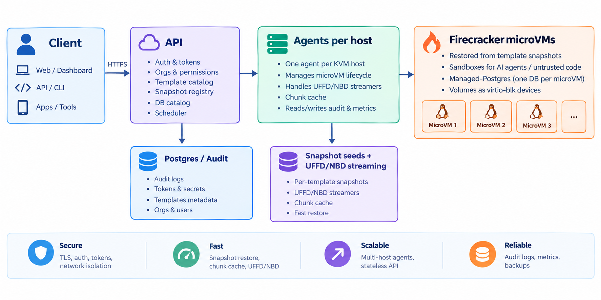

<div align="center">


# PukuCloud

**Disposable Firecracker microVMs and managed PostgreSQL — one control plane, one scheduler, one snapshot pipeline.**

[](LICENSE)
[](https://go.dev)
[](https://workers.cloudflare.com)
[](https://firecracker-microvm.github.io)
[](https://www.postgresql.org)

[Quickstart](#60-second-quickstart) · [Features](#features) · [Architecture](#architecture-at-a-glance) · [Self-host](#self-host) · [Docs](docs/README.md)

</div>

---

## What is PukuCloud?

PukuCloud ships two products on one control plane:

- **Disposable Firecracker microVM sandboxes** — for AI agents and untrusted code. Sub-second boot from baked snapshots, demand-paged memory and rootfs, snapshot/fork trees, full lifecycle (pause, resume, hibernate, TTL).
- **Managed PostgreSQL 16 databases (Beta)** — a real, durable database in its own microVM, with a native `postgres://` URL in seconds, continuous WAL archiving, and restore-based failover onto a healthy host.

Both share the same control plane, scheduler, agent fleet, and snapshot pipeline. See [docs/architecture.md](docs/architecture.md) for the full picture.

---

## 60-second quickstart

```bash
git clone https://github.com/pukucloud/pukucloud
cd pukucloud
bash scripts/mac-local-e2e.sh   # or scripts/linux-local-e2e.sh on Linux/KVM
open http://localhost:3000
```

Create a sandbox from the local API:

```bash
curl -sS http://localhost:8080/v1/sandboxes \
  -H 'Authorization: Bearer pds_local_dev_token' \
  -H 'Content-Type: application/json' \
  -d '{"template":"base"}'
```

Exec a command in it:

```bash
curl -sS http://localhost:8080/v1/sandboxes/<id>/exec \
  -H 'Authorization: Bearer pds_local_dev_token' \
  -H 'Content-Type: application/json' \
  -d '{"cmd":"uname","args":["-a"]}'
```

> Other paths into the project:
> - Apple Silicon local dev — [docs/setup-local-mac.md](docs/setup-local-mac.md)
> - Linux KVM local dev — [docs/setup-local-linux.md](docs/setup-local-linux.md)
> - Cloudflare control plane — [docs/setup-control-plane-cloudflare.md](docs/setup-control-plane-cloudflare.md)
> - AWS multi-node — [docs/setup-self-host-aws.md](docs/setup-self-host-aws.md)
> - GCP multi-node — [docs/setup-self-host-gcp.md](docs/setup-self-host-gcp.md)

---

## Features

### Sandboxes
- Firecracker microVMs with strong process and kernel isolation.
- Sub-second boot on every create via baked snapshot restore — no warm pool of idle VMs.
- Snapshot anywhere and fork running environments instantly, including fork trees (fork a fork).
- **On-demand UFFD memory streaming** — restore microVMs by paging guest memory lazily from object storage (GCS / R2 Range GETs) instead of downloading the full snapshot up front.
- **Demand-paged rootfs streaming** — the same trick for the disk: the guest's root filesystem is served over an in-kernel NBD device backed by ranged reads, so a cold host never downloads a whole rootfs before booting.
- Full lifecycle: pause, resume, hibernate, wake, TTL expiry, and idle reaping.
- Per-template CPU, RAM, and disk sizing baked into each snapshot.
- Memory admission control, a host-pressure ladder, and CPU tiers so one noisy sandbox can't starve the host.
- Network egress controls and per-sandbox network namespaces for safer code execution.
- Exec, REPL, LSP, MCP, and browser terminal surfaces.

### Managed PostgreSQL (Beta)
- Each database gets its own kernel, `postgres` process, connection pooler, and durable data volume.
- Native `postgres://` URL surfaced via REST within ~30–90 s of create.
- Continuous WAL archiving.
- Restore-to-latest failover onto a healthy host.
- Persistent: the idle reaper never deletes them; only an explicit `DELETE` destroys the data.

### Volumes & templates
- Named persistent ext4 volumes (virtio-blk) — read-write to one sandbox or read-only to many.
- Template-based images: OCI images converted to ext4 roots, plus a build pipeline for your own. Four first-party templates ship in the box: `base`, `code-interpreter`, `agent`, `postgres-16`.

### Operations
- Audit log + observability backed by Postgres and ClickHouse.
- Multi-node scheduling with capacity scoring, leases, and slot reconciliation.
- Bring-your-own auth: stub mode for dev, JWT verification against any JWKS endpoint (e.g. Supabase).

---

## Use it from your code

PukuCloud exposes a token-authenticated REST API. Point any HTTP client at your self-hosted control plane (`http://localhost:8080` for local dev) and authenticate with an API token (`pds_…`):

```bash
export PUKUCLOUD_API=http://localhost:8080
export PUKUCLOUD_API_KEY=pds_local_dev_token

# create
SBX=$(curl -sS "$PUKUCLOUD_API/v1/sandboxes" \
  -H "Authorization: Bearer $PUKUCLOUD_API_KEY" \
  -H 'Content-Type: application/json' \
  -d '{"template":"base"}' | jq -r .id)

# exec
curl -sS "$PUKUCLOUD_API/v1/sandboxes/$SBX/exec" \
  -H "Authorization: Bearer $PUKUCLOUD_API_KEY" \
  -H 'Content-Type: application/json' \
  -d '{"cmd":"uname","args":["-a"]}'

# delete
curl -sS -X DELETE "$PUKUCLOUD_API/v1/sandboxes/$SBX" \
  -H "Authorization: Bearer $PUKUCLOUD_API_KEY"
```

Python and TypeScript SDKs and the `pukucloud` CLI are published separately (`pip install pukucloud`, `npm install @pukucloud/sdk`). In this repo you talk to the platform over the REST API directly.

---

## Architecture at a glance



- **API** — the control plane. Either the self-hosted Go API (`api/`) or the Cloudflare Workers deployment (`workers/`). Same REST surface, same auth, same scheduler.
- **Agents** — one per KVM host. Boot and manage Firecracker microVMs.
- **Snapshots** — every create restores a baked per-template snapshot. UFFD memory streaming and NBD rootfs streaming keep cold hosts fast without downloading whole images up front.

Full architecture (control-plane vs data-plane boundaries, UFFD internals, scheduler design, multi-node topology): **[docs/architecture.md](docs/architecture.md)**.

---

## Repository layout

| Path | What it is |
| --- | --- |
| `api/` | Self-hosted control-plane REST API (Go). |
| `agent/` | Per-host Firecracker microVM agent (Go). |
| `db-proxy/` | SNI-routing Postgres proxy (`*.db.<zone>` → DB microVM). |
| `workers/` | Cloudflare Workers control plane (TypeScript + D1 + R2 + KV). |
| `dashboard/` | Web dashboard (Next.js) — sandboxes, databases, templates. |
| `docs/` | GitHub-rendered documentation. See [docs/README.md](docs/README.md). |
| `docs-site/` | Next.js + fumadocs documentation site (deployed to `docs.<zone>`). |
| `templates/` | microVM template Dockerfiles — `base`, `code-interpreter`, `agent`, `postgres-16`. |
| `infra/` | Terraform for AWS (`envs/dev-aws`) and GCP (`envs/dev-gcp-multi`). |
| `deploy/` | Production deploy scripts and Dockerfiles. |
| `ansible/` | Agent install + role playbooks. |
| `cloud-init/` | Host/guest provisioning scripts used by Terraform user-data. |
| `cmd/pukucloud/` | `pukucloud` CLI (Go, stdlib-only). |
| `cookbook/`, `examples/` | Tutorial recipes and example projects. |
| `logos/`, `scripts/`, `bench/`, `lima/`, `tests/` | Brand assets, dev scripts, benchmarks, Lima VM, E2E tests. |

Full per-directory ownership and reading order: **[docs/repo-layout.md](docs/repo-layout.md)**.

---

## Self-host

| Path | Topology | Doc |
| --- | --- | --- |
| Apple Silicon, local dev | Lima microVM with nested virt | [docs/setup-local-mac.md](docs/setup-local-mac.md) |
| Linux KVM host, local dev | Bare-metal or cloud VM with `/dev/kvm` | [docs/setup-local-linux.md](docs/setup-local-linux.md) |
| Cloudflare-hosted control plane, any agent fleet | Workers + D1 + R2 + KV + your agent hosts | [docs/setup-control-plane-cloudflare.md](docs/setup-control-plane-cloudflare.md) |
| AWS multi-node | VPC + edge ASG + agent ASG (`*.metal`) + RDS + ClickHouse | [docs/setup-self-host-aws.md](docs/setup-self-host-aws.md) |
| GCP multi-node | Private VPC + edge MIG + agent MIG + Cloud SQL + ClickHouse | [docs/setup-self-host-gcp.md](docs/setup-self-host-gcp.md) |

Single-node community examples live in `examples/terraform/{aws,gcp,fly}/single-node/`.

---

## Open source vs PukuCloud Cloud

This repository is the whole engine, not a demo. Everything in the **Open source** column runs on your own hardware under Apache-2.0, with **no usage limits of any kind** — the OSS edition ships unmetered and uncapped, and contains no billing, metering, quota, or subscription code at all.

**PukuCloud Cloud** is the hosted service run by the PukuCloud team. It runs this same core and adds a small number of features that stay hosted-only, plus the operational work of running a Firecracker fleet.

| | Open source (this repo) | PukuCloud Cloud |
| --- | --- | --- |
| **Sandbox lifecycle** | Full — create, exec, REPL, LSP, terminal, filesystem, pause/resume, hibernate/wake, TTL, idle reaping, delete | Same |
| **Snapshots & fork** | Full — named snapshots, instant fork of a running VM, fork trees, boot-from-snapshot | Same |
| **Memory streaming** | UFFD demand-paged guest memory from object storage | Same |
| **Rootfs streaming** | Demand-paged rootfs over in-kernel NBD | Same |
| **Templates** | Four first-party templates + build your own from any Debian-based OCI image | Same, plus first-party templates kept baked and warm for you |
| **Volumes** | Named persistent ext4 volumes, rw-exclusive / ro-shared | Same |
| **Managed Postgres** | Full — per-database microVM, native `postgres://` URL, REST query broker, continuous WAL archiving, daily base backups, restore-to-latest failover, credential rotation, idle auto-suspend | Same |
| **Database branching** | — | Branch a running database into an independent copy |
| **Point-in-time restore** | Restore to latest (used by failover) | Backup browser, clone-to-new-database, restore to any second in the retention window |
| **Connection hardening** | Direct `postgres://` URL, TLS required | Per-database IP allow lists, rate limits, pooled (PgBouncer) URL |
| **Scheduler** | Multi-node scheduler, capacity scoring, admission control, leases | Same, running across a managed multi-region fleet |
| **Observability** | Audit log, events, metrics, Postgres + ClickHouse pipeline | Same, pre-wired and retained for you |
| **Usage limits** | None. Unmetered, uncapped, no billing code | Plan-based, with support and an SLA |
| **Operations** | You run the KVM hosts, object storage, upgrades, and backups | Managed fleet, managed upgrades, support |

---

## Roadmap

- [x] Local Apple Silicon developer path with Lima and Firecracker smoke test.
- [x] Managed PostgreSQL 16 databases (Beta) — durable, per-DB microVM, native `postgres://`.
- [x] On-demand UFFD memory streaming — lazily page guest memory from object storage on restore.
- [x] Demand-paged rootfs streaming over an in-kernel NBD device.
- [ ] Read replicas and storage autoscaling for managed databases.
- [ ] Cross-host durability for volumes and databases (object-storage staging on attach).
- [ ] Single-node Linux self-host quickstart.
- [ ] Snapshot store adapters for additional object storage backends.
- [ ] Multi-node scheduler examples for Kubernetes, Nomad, and managed instance groups.
- [ ] 1.0 API stability and steering committee formation.

---

## Limitations & scope

This is the **open-source core** of PukuCloud. A few things to know before you build on it:

- **Hosts must run on bare-metal KVM.** Firecracker needs `/dev/kvm`, so agents run on Linux KVM hosts or `*.metal` cloud instances. On Apple Silicon, local dev runs Firecracker inside a Lima VM via Apple Virtualization.framework (nested virt). There is no Windows/macOS-native host path.
- **No billing or metering.** This cut ships **unmetered and uncapped** — no Stripe, no subscription tiers, no per-workspace sandbox/CPU/quota limits, and no metering code to strip out. Self-hosters run without usage limits; if you need billing, that's a layer you add yourself.
- **Sandboxes and databases only.** Git-driven app hosting, serverless functions, cron schedules, PR preview environments, custom domains, the GitHub App, and managed env-secrets are **not part of this repository**. If you find a stale reference to any of them, it's a bug — please open an issue.
- **Three features are Cloud-only.** Database branching, point-in-time restore with a backup browser and retention policies, and database connection hardening (IP allow lists, connection rate limits, pooled connection URLs) are not in this repo.
- **Auth is bring-your-own.** Ships with a `stub` mode (local dev) and JWT verification against a JWKS endpoint (e.g. Supabase). There's no built-in user database or signup flow — wire it to your own identity provider.
- **Single-tenant-ish by default.** Org/tenancy tables exist, but the access-control model is intentionally minimal. Review it before exposing the API to untrusted users.
- **Managed databases are Beta.** They work, and they are continuously archived — but read replicas, storage autoscaling, and cross-host durability are not here yet. Don't make a single Beta database the only copy of irreplaceable data.
- **Object-storage coupling.** Snapshot seeds, UFFD memory streaming, and rootfs streaming currently assume GCS or R2. Other backends need an adapter (see Roadmap).
- **Deployment is Terraform-first.** Production deploys use the multi-node Terraform envs (`infra/terraform/envs/dev-aws`, `dev-gcp-multi`). The cloud-init / user-data bootstrap scripts are functional scaffolds — review them before a real apply.
- **The dashboard screenshot is an illustration**, not a product screenshot.

---

## Documentation

Start here: **[docs/README.md](docs/README.md)** — the documentation index.

| Topic | Where |
| --- | --- |
| Cloudflare control plane setup | [docs/setup-control-plane-cloudflare.md](docs/setup-control-plane-cloudflare.md) |
| AWS multi-node self-host | [docs/setup-self-host-aws.md](docs/setup-self-host-aws.md) |
| GCP multi-node self-host | [docs/setup-self-host-gcp.md](docs/setup-self-host-gcp.md) |
| Apple Silicon local dev | [docs/setup-local-mac.md](docs/setup-local-mac.md) |
| Linux KVM local dev | [docs/setup-local-linux.md](docs/setup-local-linux.md) |
| Architecture (control / data / workloads) | [docs/architecture.md](docs/architecture.md) |
| Repository layout | [docs/repo-layout.md](docs/repo-layout.md) |
| Baking global templates | [docs/bake-global-templates.md](docs/bake-global-templates.md) |
| Secrets and config reference | [docs/secrets-and-config.md](docs/secrets-and-config.md) |
| Observability | [docs/observability.md](docs/observability.md) |
| Disaster recovery | [docs/disaster-recovery.md](docs/disaster-recovery.md) |

Subsystem-specific docs (also kept up to date):

| Subsystem | Doc |
| --- | --- |
| Infrastructure (Terraform) | [infra/README.md](infra/README.md) |
| GCP rolling-update runbook | [deploy/DEPLOY.md](deploy/DEPLOY.md) |
| Cloudflare Workers | [workers/README.md](workers/README.md) |
| Cloudflare cutover runbook | [workers/MIGRATION_TO_CLOUDFLARE.md](workers/MIGRATION_TO_CLOUDFLARE.md) |
| `pukucloud` CLI | [cmd/pukucloud/README.md](cmd/pukucloud/README.md) |
| Dashboard | [dashboard/README.md](dashboard/README.md) |

---

## Contributing

Read [CONTRIBUTING.md](CONTRIBUTING.md), [CODE_OF_CONDUCT.md](CODE_OF_CONDUCT.md), and [GOVERNANCE.md](GOVERNANCE.md) before opening a substantial PR. Security issues: [SECURITY.md](SECURITY.md).

---

## License

PukuCloud is licensed under the [Apache License 2.0](LICENSE).

---

## Credits

PukuCloud stands on excellent open-source systems and tools, including Firecracker, Lima, ClickHouse, Next.js, Postgres, Go, TypeScript, Python, Terraform, and the broader Linux virtualization ecosystem. Thank you to the maintainers and communities behind them.