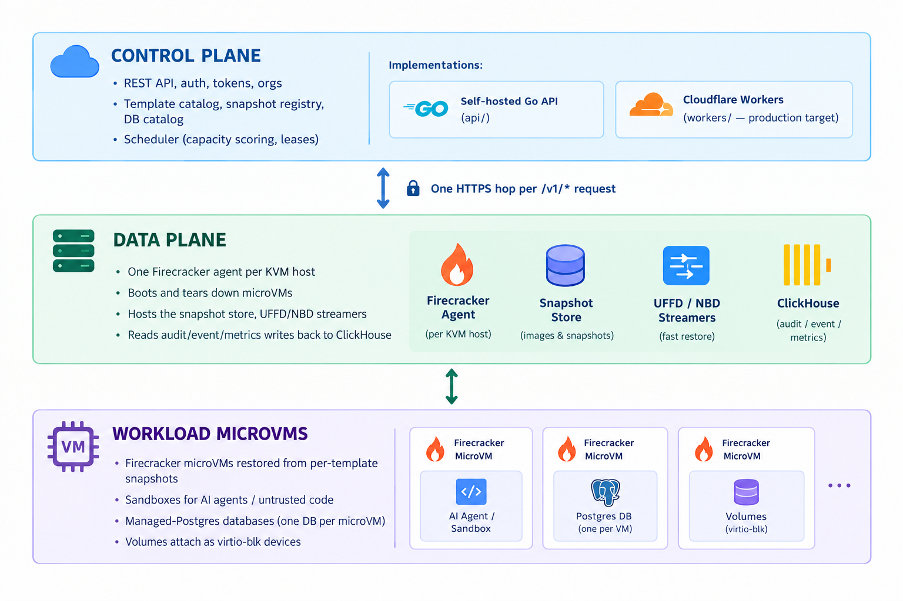
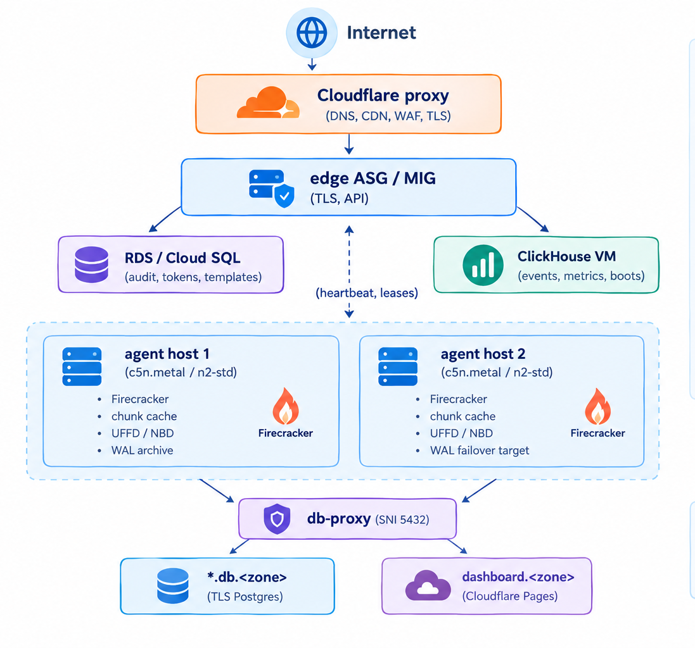

# Architecture

How PukuCloud fits together: the control plane, the data plane, and the workload microVMs. This is the single source of truth for the architecture; setup guides, runbooks, and subsystem docs all link back here.

## Contents

- [Three layers](#three-layers)
- [Control plane](#control-plane)
- [Data plane](#data-plane)
- [Workload microVMs](#workload-microvms)
- [Snapshot pipeline](#snapshot-pipeline)
- [UFFD memory streaming](#uffd-memory-streaming)
- [Demand-paged rootfs](#demand-paged-rootfs)
- [Orchestration: Temporal + Sentry + D1 + DO](#orchestration-temporal--sentry--d1--do)
- [Multi-node topology](#multi-node-topology)
- [Auth boundaries](#auth-boundaries)
- [Where each layer lives in this repo](#where-each-layer-lives-in-this-repo)

---

## Orchestration: Temporal + Sentry + D1 + DO

The control plane and the data plane are decoupled through a workflow
orchestrator (Temporal). The controller never addresses workers by IP.
Adding capacity is "start more workers on more hosts" — the controller
sees no code change.

```
   ┌────────────────────────────────────────────────────────────────┐
   │                      Cloudflare Edge                            │
   │                                                                │
   │  ┌──────────────┐         ┌──────────────────┐                 │
   │  │  Controller  │────────►│ Temporal Cloud   │ ◄──┐            │
   │  │  (Worker)    │         │ (or self-hosted)  │    │            │
   │  │              │         │                   │    │            │
   │  │  ├─ D1       │         └──────────────────┘    │            │
   │  │  │  history  │                                 │            │
   │  │  ├─ DO       │                                 │            │
   │  │  │  live     │                                 │            │
   │  │  ├─ R2       │                                 │            │
   │  │  │  snapshot │         ┌──────────────────┐    │            │
   │  │  └─ Sentry   │────────►│ Sentry           │    │            │
   │  │              │         │ (self-hosted)    │    │            │
   │  └──────────────┘         └──────────────────┘    │            │
   └───────────────────────────────────────────────────┼────────────┘
                                                       │
                          (outbound gRPC + heartbeats) │
                                                       │
            ┌──────────────────────────────────────────┼──────────┐
            │                                          │          │
       ┌────┴─────┐                              ┌─────┴────┐     │
       │ Agent    │                              │ Agent    │ ... │
       │ Go       │                              │ Go       │     │
       │ bare     │                              │ bare     │     │
       │ metal    │                              │ metal    │     │
       │          │                              │          │     │
       │ Firecracker                             │ Firecracker   │
       │ UFFD    │                              │ UFFD    │     │
       │ NBD     │                              │ NBD     │     │
       │ +Temporal│                              │ +Temporal│     │
       │  worker  │                              │  worker │     │
       └─────────┘                              └─────────┘     │
       ▲                                                              │
       │      (legacy: agent HTTP API for /exec, /filesystem, etc.) │
       └─────────────────────────────────────────────────────────────┘
```

### How a request flows

1. Dashboard → `POST /v1/sandboxes` on the CF Worker controller.
2. Controller validates, writes a "queued" row to D1, then calls
   Temporal's `StartWorkflow` for `LaunchMicroVMWorkflow` with a stable
   workflow ID.
3. Temporal's frontend dispatches the workflow's first activity
   (`LaunchMicroVM`) to the next available worker on the task queue.
4. The worker calls Firecracker / UFFD / NBD, heartbeats every 10s,
   and updates its Durable Object with live state (status, capacity).
5. On completion, the worker writes a final record to D1 and signals
   the workflow complete.
6. The dashboard polls `GET /v1/sandboxes/{workflowId}`; the controller
   serves it from D1 (history) + Temporal (live status) + DO (capacity).

### Components

| Component | Where | Purpose | Replaces |
|-----------|-------|---------|----------|
| **Temporal** | Self-hosted (or Temporal Cloud) | Workflow orchestration, retries, timeouts, leases | Old PostgreSQL scheduler, custom multi-node director |
| **Sentry** | Self-hosted | Error tracking, traces, release health | In-house ClickHouse-only observability |
| **D1** | Cloudflare | Durable history (workflows, audit log, tokens) | Old PostgreSQL control-plane DB |
| **Durable Objects** | Cloudflare | Per-agent live state (capacity, current VM) | Old in-Postgres heartbeats table |
| **R2** | Cloudflare | Snapshot, template, UFFD/NBD object store | (unchanged) |

### Adding capacity

```bash
# On a new bare-metal host:
TEMPORAL_ADDRESS=temporal.example.com:7233 ./agent
```

That's it. The new host polls Temporal for activities. No controller
re-deploy. No IP allowlist update. No load-balancer config.

### Removing capacity

Drain in two steps:

1. Send `SIGTERM` to the agent. It drains in-flight activities, then exits.
2. Temporal re-routes any pending workflows to other workers.

No graceful drain UI needed; Temporal handles the handoff.

### Why no PostgreSQL

The new architecture removes the control-plane PostgreSQL dependency.
State that used to live there is split:

| Old PG table | New location |
|--------------|--------------|
| `sandboxes` | D1 `workflows` (history) + DO (live) |
| `tokens`    | D1 `tokens` (history) |
| `audit_log` | D1 `audit_log` (history) |
| `multi-node leases` | Temporal activity leases |
| `schedules` | Temporal schedules |

The data-plane PostgreSQL instances (Temporal's own, Sentry's own)
remain — they are infrastructure, not application state.

---

---

## Three layers

PukuCloud is split along a clean control-plane / data-plane boundary. The control plane decides; the data plane executes. Workloads live one layer further down, isolated inside Firecracker microVMs.



The control plane never touches guest memory or disks directly — it only talks to agents over HTTPS, and the agents do the actual Firecracker work.

---

## Control plane

**Responsibilities:**

- Accept sandbox and database requests over REST (`/v1/sandboxes`, `/v1/databases`).
- Authenticate callers (`pds_*` tokens, JWTs, or stub mode).
- Pick a host: the scheduler scores agents by capacity, leases, and template readiness, then returns a target.
- Track the catalog: which templates exist, which snapshots are named, which databases are alive, which org owns what.
- Surface audit and metrics.

**Two implementations exist today** and they share the same REST surface so callers don't care which is deployed:

| Implementation | Path | When to use |
| --- | --- | --- |
| Self-hosted Go API | [`api/`](../api) | Single-region, on-prem, no CF account. Runs as one or more Linux processes behind your TLS terminator. |
| Cloudflare Workers | [`workers/`](../workers) | Production target. Workers + D1 + R2 + KV; agents anywhere reachable from the CF edge. |

Both store control-plane state in Postgres (Go API) or D1 (Workers) and emit events to ClickHouse. See [setup-control-plane-cloudflare.md](setup-control-plane-cloudflare.md) for the Workers setup walkthrough, and [setup-self-host-aws.md](setup-self-host-aws.md) / [setup-self-host-gcp.md](setup-self-host-gcp.md) for self-hosted.

---

## Data plane

**One Firecracker agent per KVM host.** The agent is a single Go binary (`agent/`) that:

1. Reads its template seeds + memory snapshots from object storage (GCS or R2) into a local content-addressed chunk cache.
2. Receives `/v1/sandboxes/{id}/exec|filesystem|…` from the control plane and translates them into Firecracker API calls (`InstanceStart`, `PutGuestEvents`, …).
3. Hosts the userfaultfd pager and the in-kernel NBD server that stream memory and rootfs lazily into running guests.
4. Writes sandbox events and per-sandbox metrics to ClickHouse.
5. Heartbeats to the scheduler and reconciles slot leases.

**Why one agent per host?** Firecracker needs nested virtualization or bare-metal `/dev/kvm`. There's no shared-nothing multi-tenancy inside a single agent process: each VM has its own kernel, its own tap device, its own network namespace, and its own slot. So the unit of scale is "agent host", and the scheduler treats each agent as an opaque capacity bucket.

---

## Workload microVMs

Two flavors, both backed by the same template + snapshot pipeline:

### Sandboxes
- Created from a template (`base`, `code-interpreter`, `agent`, or a user-built template).
- Disk = the template's baked rootfs; memory = the template's snapshot.
- Lifecycle: `create → exec/REPL/LSP/terminal → pause/resume → snapshot/fork → hibernate/wake → delete`.
- TTL-based expiry and an idle reaper handle cleanup.

### Managed Postgres
- Created with `POST /v1/databases`; one microVM per database.
- Inside the VM: PostgreSQL 16 + PgBouncer + a query-broker that proxies `postgres://` traffic over a vsock tunnel back to the agent (and out through `db-proxy` to the public `*.db.<zone>` SNI host).
- Continuous WAL archiving; on failure the agent restores onto a peer and the API flips the database's state to `ready` once the new VM accepts connections.

---

## Snapshot pipeline

Every create restores a baked per-template snapshot. The pipeline is the same for sandboxes and databases:

```text
templates/<name>/Dockerfile
        │  pukucloud-agent seed-sync on agent boot
        ▼
gcs://<bucket>/templates/<name>/rootfs.ext4   (or r2://)
        │  + memory snapshot (vm.mem + vmstate)
        ▼
local chunk cache on the agent (content-addressed)
        │  InstanceStart with --snapshot
        ▼
microVM boots in ~150 ms (cold host) or <50 ms (warm host)
```

Template authoring: see [bake-global-templates.md](bake-global-templates.md). Per-template baking (`pukucloud template build`) is a separate path that lets users turn their own Dockerfile into a template.

---

## UFFD memory streaming

Cold hosts don't have to download the full memory snapshot. The agent:

1. Starts the VM with a sparse memory file (the snapshot's `vmstate` + `vm.mem`).
2. Runs a `userfaultfd` pager that handles missing pages by issuing a Range GET against object storage.
3. Pages are cached locally in the chunk cache; subsequent faults hit cache.

Effect: a create on a cold host boots in ~150 ms; a warm host (recent same-template restore) is sub-50 ms. The cost is that the first fault on each new page blocks guest execution until the range returns — typically a few ms.

---

## Demand-paged rootfs

Same idea, applied to disk. Instead of mounting the full `rootfs.ext4` read-only, the agent:

1. Creates an in-kernel NBD device backed by a small in-memory stub.
2. Wires `nbd` to a Go service that, on each read, issues a Range GET for the corresponding chunk of the rootfs.
3. The guest kernel's page cache fills in on demand; reads beyond what's been touched never reach the host.

Net effect: a cold agent can boot any template without first downloading the entire rootfs.

---

## Orchestrator

Workflow orchestration is handled by Temporal. The agent polls a task
queue and executes activities (`LaunchMicroVM`, `PauseMicroVM`, etc.).
Workflows are crash-safe: if an agent dies mid-launch, Temporal re-routes
the activity to another agent.

The previous Go scheduler (`api/internal/scheduler/`) and the
`MultiNodeDirector` are deprecated. They were replaced by Temporal's
built-in task queue routing and retry semantics. See
[orchestration-temporal-sentry-d1-do](#orchestration-temporal--sentry--d1--do)
above.

---

## Multi-node topology

A typical self-hosted AWS or GCP fleet looks like:



Concrete numbers (instance sizes, costs, caveats) live in [infra/README.md](../infra/README.md). The Cloudflare Workers deployment shrinks the control plane to "just the edge" and lets you keep the same agent fleet — see [setup-control-plane-cloudflare.md](setup-control-plane-cloudflare.md).

**Operator walkthrough** — how the `MultiNodeDirector` picks an agent, how heartbeats and leases work, how to add or drain a node, the burst-spread mechanism, and the known gaps — lives in [multi-node.md](multi-node.md).

---

## Auth boundaries

Three trust boundaries are enforced by the control plane:

| Boundary | Token / header | Where it's checked |
| --- | --- | --- |
| Caller → control plane | `pds_*` API token or JWT (`Authorization: Bearer …`) | Control-plane auth middleware (`api/internal/auth`, `workers/src/middleware/auth.ts`) |
| Control plane → agent | `PUKUCLOUD_AGENT_TOKEN` (shared bearer) + `X-Node-Token` for node-to-node | Agent HTTP handler (`agent/internal/api`) |
| Agent → guest (db-proxy tunnel) | `pds_pg_*` Postgres token (in-VM) | query-broker inside the guest, validated against the parent DB catalog |

The Workers control plane forwards the user's `pds_*` token **and** the shared agent token in the same `Authorization` header — the agent strips the user's token and trusts the agent token. See [setup-control-plane-cloudflare.md](setup-control-plane-cloudflare.md) for the exact wire format and the open gaps.

---

## Where each layer lives in this repo

| Layer | Path | Owns |
| --- | --- | --- |
| Control plane | [`workers/`](../workers) | TypeScript + Hono, D1 + R2 + KV + Durable Objects bindings, Temporal client. |
| Temporal worker | [`agent/internal/temporal/`](../agent/internal/temporal) | Workflow + activity registration, heartbeat reporting. |
| Data plane | [`agent/`](../agent) | Firecracker SDK, slotstore, snapstore, memstream (UFFD), diskstream (NBD), templates, OCI registry, Temporal worker. |
| Postgres tunnel | [`db-proxy/`](../db-proxy) + [`templates/postgres-16/query-broker/`](../templates/postgres-16) | SNI proxy + in-VM query broker. |
| Templates | [`templates/`](../templates) | First-party `base` / `code-interpreter` / `agent` / `postgres-16` Dockerfiles. |
| Self-hosted infra | [`infra/temporal/`](../infra/temporal), [`infra/sentry/`](../infra/sentry) | Temporal and Sentry docker-compose stacks. |
| Deployment | [`infra/`](../infra), [`deploy/`](../deploy), [`cloud-init/`](../cloud-init), [`ansible/`](../ansible) | Terraform envs, rolling update runbook, host provisioning. |
| Dashboard | [`dashboard/`](../dashboard) | Next.js UI; deployed to `app.<zone>` on Cloudflare Pages. |
| CLI | [`cmd/pukucloud/`](../cmd/pukucloud) | Stdlib-only Go CLI for sandboxes, templates, tokens. |
| Docs | [`docs/`](../docs), [`docs-site/`](../docs-site) | GitHub-rendered (this folder) and Next.js docs site. |

> The previous Go control plane ([`api/`](../api)) is deprecated. Its
> responsibilities are split between the Cloudflare Worker (REST + D1 +
> DO + Temporal client) and the Temporal server (orchestration). The
> `api/` directory is kept for now to host test fixtures and is removed
> in a follow-up commit.

For per-directory ownership and reading order, see [repo-layout.md](repo-layout.md).

---

## See also

- [setup-control-plane-cloudflare.md](setup-control-plane-cloudflare.md)
- [setup-self-host-aws.md](setup-self-host-aws.md)
- [setup-self-host-gcp.md](setup-self-host-gcp.md)
- [disaster-recovery.md](disaster-recovery.md)
- [observability.md](observability.md)
- [repo-layout.md](repo-layout.md)