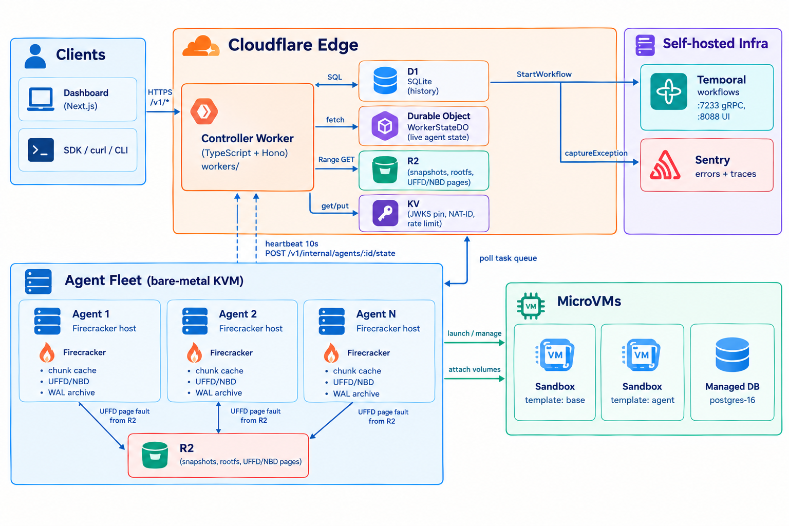
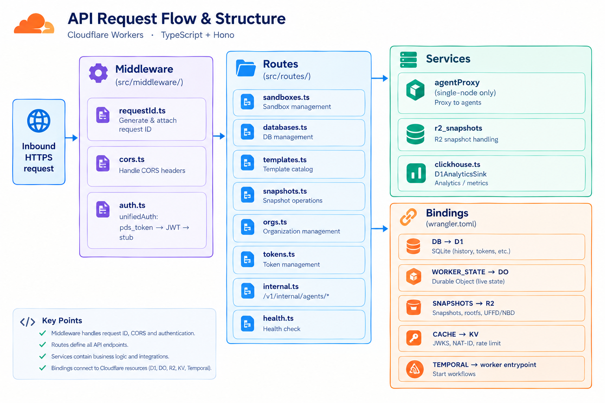
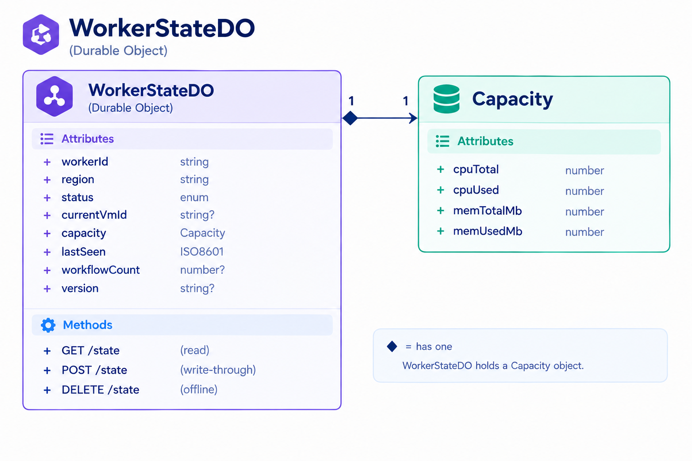
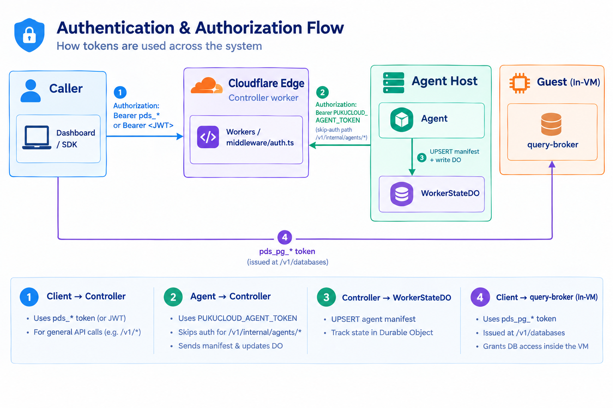
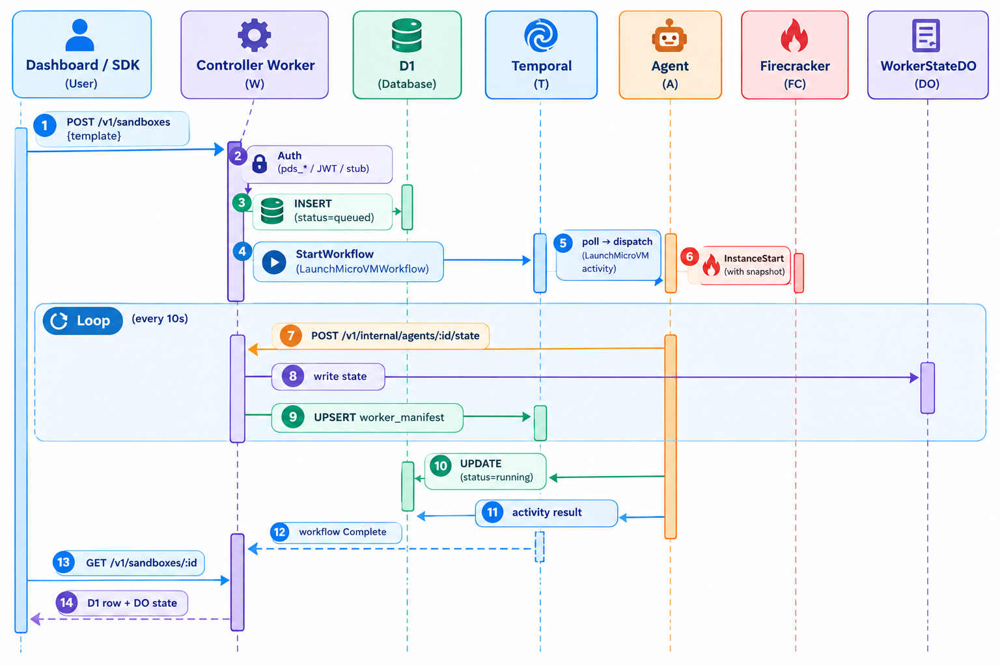
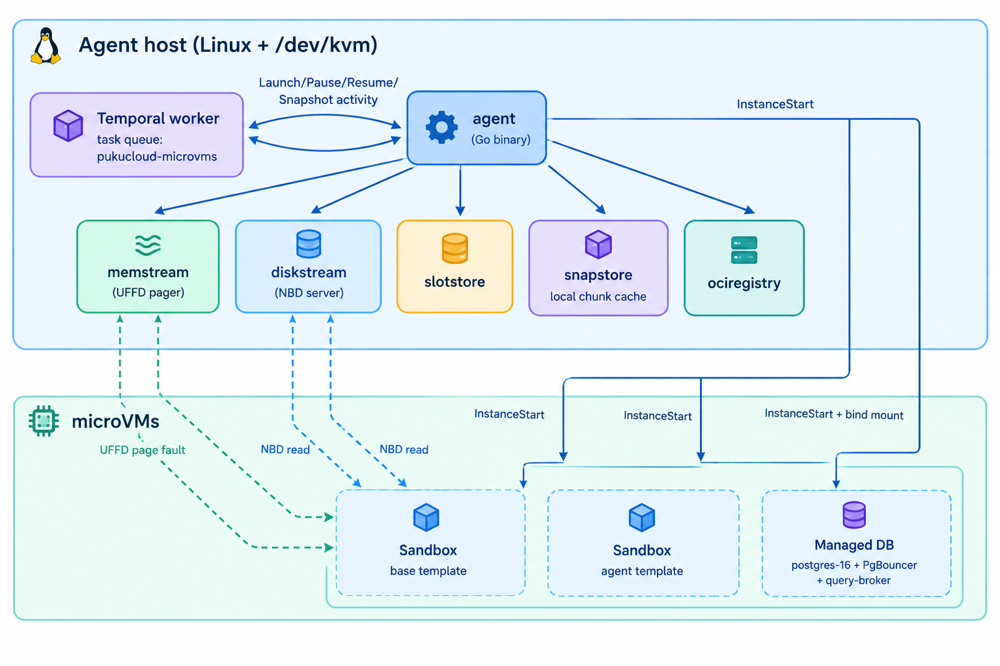
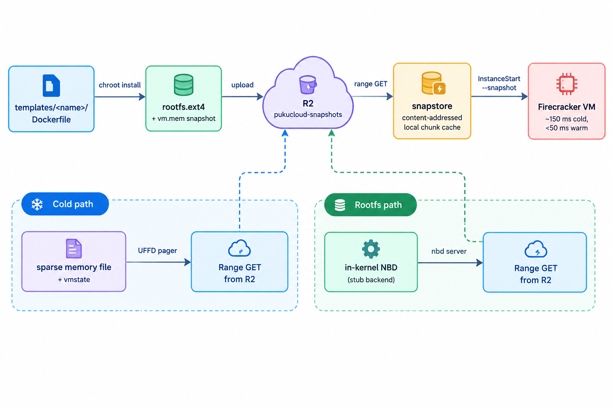

# Architecture

How PukuCloud fits together. This is the single source of truth — setup guides, runbooks, and subsystem docs all link back here.

## Overview diagram



Read it as: **clients → controller** (one HTTPS hop). **Controller → stores** (D1, DO, R2, KV) for state. **Controller → Temporal** to schedule work. **Agents ← Temporal** to receive activities. **Agents → controller** heartbeats every 10 s, which the controller writes into the `WorkerStateDO`. **Agents → R2** for UFFD/NBD page fetches on cold boot.

There is no PostgreSQL anywhere in this project. The data-plane PostgreSQL instances (Temporal's own, Sentry's own) are infrastructure, not application state.

---

## Control plane

The control plane is one Cloudflare Worker (`workers/`, TypeScript + Hono). It owns:

- **HTTP surface** — all `/v1/*` routes (sandboxes, databases, templates, snapshots, tokens, orgs) and the internal agent endpoints.
- **Auth** — `pds_*` API tokens, JWT verification against any JWKS endpoint (Supabase, Auth0, etc.), or stub mode for local dev.
- **D1 queries** — every durable fact is a SQL row in one of seven migration files.
- **DO reads/writes** — for live agent state.
- **Temporal client** — starts workflows; never talks to agents directly.
- **Sentry transport** — forwards errors and traces.

It does **not** run workflows itself and does **not** boot VMs. It decides; agents execute.

### Inside the controller



The middleware chain is fixed: every request gets a request-id, then CORS, then auth. Routes only run after auth succeeds (with the documented skip-auth list including `/v1/internal/agents/*` and `/healthz`).

### D1 schema (current migrations)

```
0001_initial.sql
0001_orgs_and_members.sql
0002_tokens_and_auth.sql
0003_sandboxes.sql
0004_databases.sql
0005_templates_and_snapshots.sql
0006_agents_and_natid.sql
```

### WorkerStateDO (live agent state)

`workers/src/durable_objects/workerState.ts` defines one DO instance per agent. The DO is the source of truth for live state; the agent writes through on every heartbeat (every 10 s) and the controller reads it for `/v1/workers`.



`status` is one of `idle \| busy \| launching \| draining \| offline`. `draining` means "no new work; in-flight will finish". The D1 `worker_manifest` table is the index — it lists which `workerId`s exist, and the controller fans out to the corresponding DO instances in parallel when listing.

### Auth boundaries



Three trust boundaries, all bearer-token:

| Boundary | Token | Where checked |
|---|---|---|
| Caller → controller | `pds_*` token or JWT (verified against `SUPABASE_JWKS_URL` if set) | `workers/src/middleware/auth.ts` |
| Agent → controller | `PUKUCLOUD_AGENT_TOKEN` (shared fleet+controller secret) | Controller route handler, then D1 + DO write |
| Public → guest (db-proxy) | `pds_pg_*` Postgres token issued at `POST /v1/databases` | `db-proxy` SNI router, then query-broker inside the guest |

---

## Orchestrator: Temporal + Sentry

The control plane and the data plane are decoupled through a workflow orchestrator. **The controller never addresses workers by IP.** Adding capacity is "start another agent on another host" — the controller sees no code change.


Each activity heartbeats every 10 s so Temporal can detect a dead host and re-route. If an agent dies mid-launch, Temporal schedules the activity on another host. Nothing is lost.

Sentry has two projects:

- `pukucloud-controller` (Node) — request-path errors, latency traces, SLO transactions.
- `pukucloud-agent` (Go) — agent crashes, Firecracker API failures, UFFD/NBD errors, heartbeat timeouts.

### Request flow



---

## Data plane: the agents

**One Firecracker agent per KVM host.** The agent is a single Go binary (`agent/`) that:

1. Reads template seeds + memory snapshots from R2 into a local content-addressed chunk cache.
2. Polls Temporal for activities and runs them against Firecracker (`InstanceStart`, `PutGuestEvents`, …).
3. Hosts the `userfaultfd` pager that streams guest memory lazily from R2 on first fault.
4. Hosts the in-kernel NBD server that serves the guest rootfs on demand.
5. Heartbeats live state to the controller's `WorkerStateDO` every 10 s.



### Why one agent per host

Each microVM has its own kernel, its own tap device, its own network namespace, and its own slot. There is no shared-nothing multi-tenancy inside a single agent process — every VM is fully isolated. So the **unit of scale is the host**, and the scheduler (Temporal's task queue) treats each agent as an opaque capacity bucket.

What lives where inside an agent host:

| Path | Owns |
| --- | --- |
| `agent/internal/temporal/` | Temporal worker lifecycle, workflow/activity registration. |
| `agent/internal/firecracker/` | Firecracker SDK wrapper, instance lifecycle. |
| `agent/internal/memstream/` | UFFD pager. |
| `agent/internal/diskstream/` | NBD rootfs server. |
| `agent/internal/snapstore/`, `slotstore/`, `netns/` | Per-host local stores. |
| `agent/internal/ociregistry/` | OCI image → ext4 conversion (template build). |
| `agent/internal/guest/`, `agent/internal/uffd/` | Guest-side services reachable over vsock. |

---

## Workload microVMs

Two flavors, **same template + snapshot pipeline**:

**Sandboxes** — created from a template. Lifecycle: `create → exec/REPL/LSP/terminal → pause/resume → snapshot/fork → hibernate/wake → delete`. TTL and an idle reaper handle cleanup.

**Managed Postgres (Beta)** — `POST /v1/databases`. One microVM per database. Native `postgres://` URL via the `db-proxy` SNI tunnel. Continuous WAL archiving; on failure the agent restores onto a peer and the controller flips state to `ready`.

---

## Fleet topology and scaling

### Adding capacity

```bash
TEMPORAL_ADDRESS=temporal.your-domain.tld:7233 \
PUKUCLOUD_WORKER_ID=host-2 \
PUKUCLOUD_REGION=us-east-1 \
PUKUCLOUD_CONTROLLER_URL=https://pukucloud-api.<account>.workers.dev \
PUKUCLOUD_AGENT_TOKEN=<shared secret> \
./agent
```

That's it. The new host polls Temporal for activities. No controller re-deploy. No IP allowlist. No load balancer.

### Removing capacity

Two options:

- **Soft drain** — set `status: "draining"` in the DO (or wait for the agent to publish it on `SIGTERM`). The agent finishes in-flight activities, then stops accepting new ones. Temporal re-routes pending workflows elsewhere.
- **Hard kill** — `SIGKILL` or pull the plug. Temporal detects the dead activity after the heartbeat timeout (default 30 s) and re-routes.

Temporal's built-in task-queue routing + retry semantics handle everything that a previous in-house scheduler used to do.

---

## Snapshot pipeline



Template authoring: see [bake-global-templates.md](bake-global-templates.md).

### UFFD memory streaming

Cold hosts don't have to download the full memory snapshot. The agent:

1. Starts the VM with a sparse memory file (`vmstate` + `vm.mem`).
2. Runs a `userfaultfd` pager that handles missing pages by issuing a Range GET against R2.
3. Pages are cached locally in the chunk cache; subsequent faults hit cache.

Effect: a create on a cold host boots in ~150 ms; a warm host is sub-50 ms. The first fault on each new page blocks guest execution until the range returns — typically a few ms.

### Demand-paged rootfs

Same idea, applied to disk. Instead of mounting the full `rootfs.ext4` read-only, the agent:

1. Creates an in-kernel NBD device backed by a small in-memory stub.
2. Wires `nbd` to a Go service that issues a Range GET for the corresponding chunk of the rootfs on each read.
3. The guest kernel's page cache fills in on demand; reads beyond what's been touched never reach the host.

Net effect: a cold agent can boot any template without first downloading the entire rootfs.

---

## Where each layer lives in this repo

| Layer | Path | Owns |
|---|---|---|
| Control plane | [`workers/`](../workers) | TypeScript + Hono, D1 + R2 + KV + Durable Objects bindings, Temporal client, Sentry transport. |
| Orchestrator (workflows + activities) | [`agent/internal/temporal/`](../agent/internal/temporal) | `LaunchMicroVMWorkflow`, `PauseMicroVMWorkflow`, `ResumeMicroVMWorkflow`, `SnapshotMicroVMWorkflow`, `Database*Workflow`; activities `LaunchMicroVM`, `PauseMicroVM`, `ResumeMicroVM`, `SnapshotMicroVM`, `ReportHeartbeat`. |
| Live state | [`workers/src/durable_objects/workerState.ts`](../workers/src/durable_objects/workerState.ts) | `WorkerStateDO` per agent; D1 `worker_manifest` as the index. |
| Durable history | [`workers/migrations/`](../workers/migrations) | Seven SQL migrations. |
| Data plane (agent) | [`agent/`](../agent) | Firecracker SDK, slotstore, snapstore, memstream (UFFD), diskstream (NBD), OCI registry, Temporal worker. |
| Postgres tunnel | [`db-proxy/`](../db-proxy) + [`templates/postgres-16/query-broker/`](../templates/postgres-16) | SNI proxy + in-VM query broker. |
| Templates | [`templates/`](../templates) | First-party `base` / `code-interpreter` / `agent` / `postgres-16` Dockerfiles. |
| Self-hosted infra | [`infra/temporal/`](../infra/temporal), [`infra/sentry/`](../infra/sentry) | Temporal and Sentry docker-compose stacks. |
| Deployment | [`infra/`](../infra), [`deploy/`](../deploy), [`cloud-init/`](../cloud-init), [`ansible/`](../ansible) | Terraform envs (legacy, see notes), host provisioning. |
| Dashboard | [`dashboard/`](../dashboard) | Next.js UI. |
| CLI | [`cmd/pukucloud/`](../cmd/pukucloud) | Stdlib-only Go CLI. |
| Docs | [`docs/`](../docs) | This folder. |

> The legacy `infra/terraform/envs/{dev-aws,dev-gcp-multi}` directories are kept for reference only — they describe a deploy shape that was superseded by the Cloudflare Workers control plane. They are not on the supported path.

---

## See also

- [setup-control-plane-cloudflare.md](setup-control-plane-cloudflare.md) — the canonical "deploy the controller" walkthrough.
- [multi-node.md](multi-node.md) — how adding a host changes (and doesn't change) the rest of the system.
- [observability.md](observability.md) — what flows into Temporal history and Sentry, and how to read it.