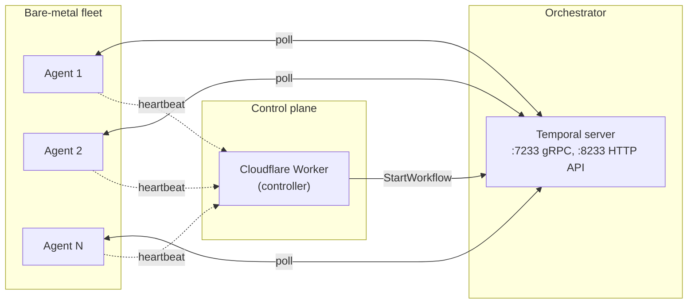

# Multi-node PukuCloud

How to run more than one agent behind the same control plane: what the controller does, how agents register, where state lives, and how to add or remove a node without losing sandboxes.

For the high-level picture see [architecture.md](architecture.md#fleet-topology-and-scaling). This doc is the operator walkthrough.

## Contents

- [How multi-node is wired](#how-multi-node-is-wired)
- [The single switch: `TEMPORAL_ADDRESS`](#the-single-switch-temporal_address)
- [Agent registration and heartbeats](#agent-registration-and-heartbeats)
- [Scheduler: Temporal task queues](#scheduler-temporal-task-queues)
- [Adding a node](#adding-a-node)
- [Removing a node (drain)](#removing-a-node-drain)
- [Failure handling](#failure-handling)
- [Known gaps](#known-gaps)
- [Verifying it works locally](#verifying-it-works-locally)

---

## How multi-node is wired

Three things have to exist for multi-node:

1. **A shared Temporal server** reachable from the controller and every agent. Workflows live in Temporal's history; the agents poll task queues. The controller (a CF Worker) talks to Temporal over its HTTP API (port 8233 in `infra/temporal/docker-compose.yml`) since CF Workers cannot open arbitrary TCP.
2. **The controller** — the Cloudflare Worker that starts workflows and exposes the public API.
3. **One or more agent hosts**. Each agent polls Temporal's `pukucloud-microvms` task queue and heartbeats its live state to the controller's `WorkerStateDO` every 10 s.



Adding capacity is "start another agent on another host" — the controller sees no code change.

---

## The single switch: `TEMPORAL_ADDRESS`

`TEMPORAL_ADDRESS` is the one environment variable that wires multi-node:

| Where | Value | Effect |
|---|---|---|
| Controller (`wrangler.toml` `[vars]`) | `https://temporal.your-domain.tld:8233` | Worker can schedule; agent heartbeats arrive as strings. |
| Agent (`/etc/pukucloud/agent.env`) | `temporal.your-domain.tld:7233` | Agent polls Temporal's gRPC task queue. |

If `TEMPORAL_ADDRESS` is unset on the agent, the agent starts but does not join the scheduler — it is effectively offline. The controller's behavior does not change when `TEMPORAL_ADDRESS` is missing; it always goes through Temporal.

---

## Agent registration and heartbeats

When an agent starts:

1. Reads `PUKUCLOUD_WORKER_ID`, `PUKUCLOUD_REGION`, `PUKUCLOUD_CONTROLLER_URL`, `PUKUCLOUD_AGENT_TOKEN` from its env file.
2. Connects to Temporal at `TEMPORAL_ADDRESS:7233`, registers the task queue (`pukucloud-microvms` by default).
3. Starts a heartbeat goroutine that POSTs `POST /v1/internal/agents/{worker_id}/state` to the controller every 10 s.
4. The controller upserts a row in D1 `worker_manifest` and writes the live state to the `WorkerStateDO` instance for that `worker_id`.

The controller's `/v1/workers` endpoint reads `worker_manifest` to enumerate IDs, then fans out to the corresponding `WorkerStateDO` instances in parallel.

Heartbeat payload (simplified):

```json
{
  "status": "busy",
  "current_vm_id": "vm_01HXY...",
  "capacity": { "cpu_total": 72, "cpu_used": 18, "mem_total_mb": 196608, "mem_used_mb": 49152 },
  "workflow_count": 3,
  "version": "0.4.2"
}
```

A worker that misses three consecutive heartbeats (> 30 s) is marked `offline` in the DO.

---

## Scheduler: Temporal task queues

The controller calls `StartWorkflow(LaunchMicroVMWorkflow, …)` with a stable id (the sandbox id). Temporal persists the workflow in its own database and routes each activity to the next available poller on `pukucloud-microvms`. There is no scheduler code in the controller or in the agent; Temporal's task-queue routing + retry semantics handle everything.

Work queue characteristics:

- **One task queue per workflow type** today (default: `pukucloud-microvms` for all four VM workflows).
- **No priority classes yet** — FIFO within the queue. A high-priority create blocks on a long snapshot activity in front of it. If you need priority, run a second task queue.
- **Activity heartbeat timeout**: 60 s default. If an agent stops heartbeating for > 60 s, Temporal considers the activity dead and re-routes it to another poller.

---

## Adding a node

```bash
# On the new host:
sudo tee /etc/pukucloud/agent.env >/dev/null <<'EOF'
TEMPORAL_ADDRESS=temporal.your-domain.tld:7233
TEMPORAL_NAMESPACE=default
TEMPORAL_TASK_QUEUE=pukucloud-microvms
SENTRY_DSN=https://abc123@sentry.your-domain.tld/1
PUKUCLOUD_WORKER_ID=host-N          # unique
PUKUCLOUD_REGION=us-east-1
PUKUCLOUD_ENV=production
PUKUCLOUD_CONTROLLER_URL=https://pukucloud-api.<account>.workers.dev
PUKUCLOUD_AGENT_TOKEN=<shared with the controller's wrangler secret>
EOF
sudo systemctl enable --now pukucloud-agent
```

Within ~30 s the agent re-subscribes to the task queue. New workflows are routed to it (and to every other agent) automatically. Verify via `curl $PUKUCLOUD_CONTROLLER_URL/v1/workers` — the new agent appears with `status: "idle"`.

No controller re-deploy. No IP allowlist. No load balancer.

---

## Removing a node (drain)

Two paths. See [runbooks/agent-evacuation.md](runbooks/agent-evacuation.md) for the full procedure.

**Soft drain (preferred):**

```bash
ssh agent-3.internal
sudo systemctl stop pukucloud-agent
```

The agent's shutdown handler:

1. Sets `status: "draining"` on its `WorkerStateDO`.
2. Lets in-flight activities finish (up to `PUKUCLOUD_HIBERNATE_BUDGET_SECONDS`, default 120 s).
3. Exits cleanly.

The controller stops placing new workflows on it within ~10 s. Pending workflows are picked up by other agents.

**Hard kill (last resort):**

```bash
sudo systemctl kill -s SIGKILL pukucloud-agent
```

Temporal detects the dead activity after the heartbeat timeout (default 60 s) and re-routes. Persistent VMs on the dead host are lost.

After a drain:

```bash
# Verify the host is gone from the controller's view:
curl -fsS $PUKUCLOUD_CONTROLLER_URL/v1/workers | jq '.workers[] | {worker_id, status}'
# should show one fewer agent, last-seen frozen
```

---

## Failure handling

| What | What happens |
|---|---|
| Agent dies mid-activity | Temporal's heartbeat timeout (60 s) fires; activity is re-queued and picked by another agent. |
| Agent dies with a managed DB | DB is lost (host-pinned PGDATA). Use [runbooks/disaster-recovery.md#managed-postgres-failover](disaster-recovery.md#managed-postgres-failover). |
| Controller (Worker) regional outage | Cloudflare routes around the failure. Customers see elevated 5xx rate for the duration. |
| Temporal down | New creates time out after the controller's `StartWorkflow` deadline. See [runbooks/temporal-failover.md](runbooks/temporal-failover.md). |
| Network partition between agent and controller | Heartbeats fail. Controller marks agent `offline` after 3 missed heartbeats. The agent may still be running activities that the controller has lost track of — Temporal's heartbeat timeout catches those. |

---

## Known gaps

These are tracked and may surprise you during incident response:

- **D1 single-region.** The controller's D1 lives in Cloudflare's home region. A CF regional outage takes the controller down; agents keep running but stop receiving new workflows (and stop heartbeating to the same endpoint).
- **No `wrangler rollback` for the agent fleet.** The agent binary is forward-compatible at the activity-name level. To roll back, restart the host with the previous binary.
- **Drained agents are not "remembered."** A drained agent's identity (`PUKUCLOUD_WORKER_ID`) is free to be reused by a new host. If you care about stable audit tags, pick new IDs after each decommission.
- **2026-08-22 incident: burst-spread.** A bug in the previous scheduler's burst-spread heuristic once routed a workload to a host that had not finished seed-sync, causing repeated cold boots. The new Temporal-based scheduler does not have burst-spread — capacity is opaque, FIFO on the task queue. This class of bug is gone.

---

## Verifying it works locally

The fastest way to validate multi-node is:

1. Bring up Temporal + Sentry per [setup-temporal-self-host.md](setup-temporal-self-host.md).
2. Run `wrangler dev` for the Workers control plane, pointing at the local Temporal.
4. Start two agents on different ports with different `PUKUCLOUD_WORKER_ID`s:

   ```bash
   TEMPORAL_ADDRESS=localhost:7233 \
   PUKUCLOUD_WORKER_ID=host-1 \
   PUKUCLOUD_CONTROLLER_URL=http://localhost:8787 \
   PUKUCLOUD_AGENT_TOKEN=<match wrangler .dev.vars> \
   ./agent --listen :8081 &

   TEMPORAL_ADDRESS=localhost:7233 \
   PUKUCLOUD_WORKER_ID=host-2 \
   PUKUCLOUD_CONTROLLER_URL=http://localhost:8787 \
   PUKUCLOUD_AGENT_TOKEN=<match wrangler .dev.vars> \
   ./agent --listen :8082 &
   ```

5. Watch the controller's logs; both agents appear in `GET /v1/workers` within ~30 s.
6. Create a sandbox; the activity lands on whichever agent polls first. Kill that agent; Temporal re-routes the next activity to the survivor.

---

## See also

- [architecture.md](architecture.md#fleet-topology-and-scaling) — the fleet topology diagram.
- [setup-control-plane-cloudflare.md](setup-control-plane-cloudflare.md) — controller deployment.
- [setup-temporal-self-host.md](setup-temporal-self-host.md) — bring up Temporal + Sentry.
- [runbooks/agent-evacuation.md](runbooks/agent-evacuation.md) — drain a single agent.