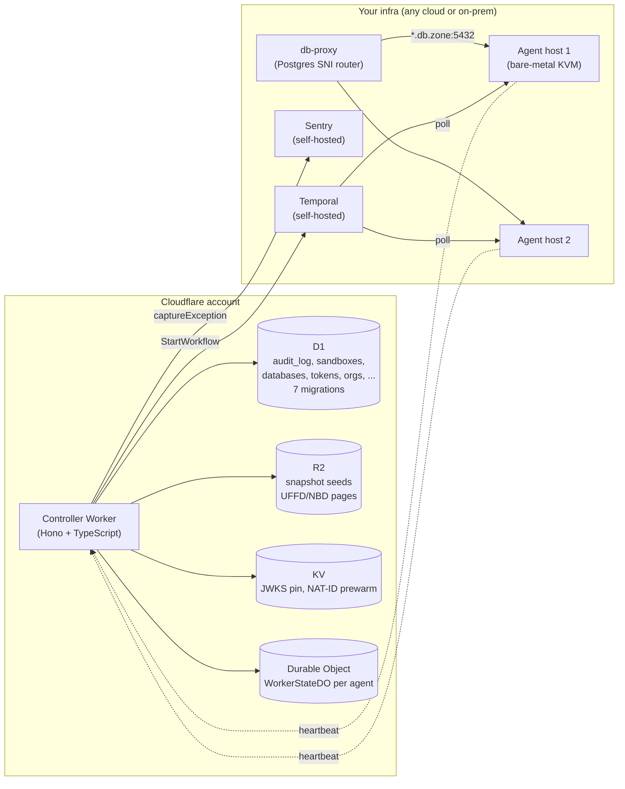

# Cloudflare control plane setup

Stand up the PukuCloud control plane on Cloudflare Workers (D1 + R2 + KV + Durable Objects), wire it to a self-hosted Temporal + Sentry, and run agents on your own bare-metal hosts. This is the production deployment target.

For local dev (one machine, Temporal in docker), see [setup-local-linux.md](setup-local-linux.md) or [setup-local-mac.md](setup-local-mac.md). For just bringing up Temporal + Sentry, see [setup-temporal-self-host.md](setup-temporal-self-host.md).

## Contents

- [What this deploys](#what-this-deploys)
- [Prerequisites](#prerequisites)
- [Step 1 — Cloudflare account and DNS](#step-1--cloudflare-account-and-dns)
- [Step 2 — Local tools](#step-2--local-tools)
- [Step 3 — Bring up Temporal + Sentry](#step-3--bring-up-temporal--sentry)
- [Step 4 — Provision D1, KV, and R2](#step-4--provision-d1-kv-and-r2)
- [Step 5 — Configure wrangler.toml](#step-5--configure-wranglertoml)
- [Step 6 — Set secrets](#step-6--set-secrets)
- [Step 7 — Apply D1 migrations](#step-7--apply-d1-migrations)
- [Step 8 — Deploy](#step-8--deploy)
- [Step 9 — Smoke test](#step-9--smoke-test)
- [Step 10 — Front the db-proxy with Spectrum](#step-10--front-the-db-proxy-with-spectrum)
- [Step 11 — Boot agents](#step-11--boot-agents)
- [Cutover and rollback](#cutover-and-rollback)
- [Cost expectations](#cost-expectations)

---

## What this deploys



Only the **control plane** lives on Cloudflare. The agents stay on your bare-metal KVM hosts (Firecracker needs `/dev/kvm`). Temporal and Sentry are self-hosted.

---

## Prerequisites

| Requirement | Notes |
|---|---|
| Cloudflare account with Workers + D1 + R2 + KV + Spectrum entitlement | Free tier works for evaluation; production needs paid. |
| Wildcard DNS zone delegated to Cloudflare | e.g. `example.com`. The Worker will live at `pukucloud-api.<zone>`. |
| One or more bare-metal KVM hosts reachable from the internet (or via Cloudflare Tunnel) | For the agents. |
| `wrangler` >= 3.x | `npm i -g wrangler`. |
| Node.js 22.x | Matches `docs-site/.nvmrc`; required for `vitest-pool-workers`. |
| A host (or two) for Temporal + Sentry | Docker + docker-compose. Could be a small VM. |

---

## Step 1 — Cloudflare account and DNS

1. Sign in to the Cloudflare dashboard.
2. Add your zone (`example.com`) and ensure nameservers are delegated.
3. Confirm D1, R2, KV, and Spectrum are enabled on your plan (Spectrum is a paid add-on; everything else has a free tier).

---

## Step 2 — Local tools

```bash
nvm install 22 && nvm use 22
npm install -g wrangler
wrangler --version          # >= 3.x
wrangler login
```

---

## Step 3 — Bring up Temporal + Sentry

Follow [setup-temporal-self-host.md](setup-temporal-self-host.md) on a small VM (or two). Note:

- The controller talks to Temporal over its HTTP API (port 8233). The agents talk over gRPC (port 7233). The Temporal UI runs on port 8080 if you start the `ui` profile.
- Create two Sentry projects: `pukucloud-controller` (Node) and `pukucloud-agent` (Go). Copy each DSN.

You will need:

- `TEMPORAL_ADDRESS` for the controller (HTTPS to the HTTP API).
- `TEMPORAL_ADDRESS` for the agents (gRPC, `:7233`).
- `SENTRY_DSN` for the controller (from the `pukucloud-controller` project).
- `SENTRY_DSN` for the agents (from the `pukucloud-agent` project).

---

## Step 4 — Provision D1, KV, and R2

Run each command and capture the IDs / names it prints — they go into `wrangler.toml`.

```bash
cd workers

# D1 — one per environment
npx wrangler d1 create pukucloud-db
npx wrangler d1 create pukucloud-db-staging

# KV — one namespace per environment
npx wrangler kv:namespace create CACHE
npx wrangler kv:namespace create CACHE --env staging

# R2 — snapshot / seed / UFFD / NBD backing store
npx wrangler r2 bucket create pukucloud-snapshots
npx wrangler r2 bucket create pukucloud-snapshots-staging
```

Each `wrangler d1 create` prints a `database_id`. Each `wrangler kv:namespace create` prints an `id`. Paste these into `wrangler.toml` (see Step 5).

---

## Step 5 — Configure `wrangler.toml`

Open `workers/wrangler.toml` and replace the placeholders.

```toml
[[d1_databases]]
binding = "DB"
database_name = "pukucloud-db"
database_id = "<paste from wrangler d1 create pukucloud-db>"
migrations_dir = "migrations"

[env.staging]
[[env.staging.d1_databases]]
binding = "DB"
database_name = "pukucloud-db-staging"
database_id = "<paste from wrangler d1 create pukucloud-db-staging>"

[[kv_namespaces]]
binding = "CACHE"
id = "<paste from wrangler kv:namespace create CACHE>"

[env.staging]
[[env.staging.kv_namespaces]]
binding = "CACHE"
id = "<paste from wrangler kv:namespace create CACHE --env staging>"
```

Then set the public vars:

```toml
[vars]
PUKUCLOUD_ENV = "production"
PUKUCLOUD_API_VERSION = "0.1.0"
PUKUCLOUD_DASHBOARD_URL = "https://app.example.com"
PUKUCLOUD_CONTROLLER_URL = "https://pukucloud-api.<account>.workers.dev"
TEMPORAL_ADDRESS = "https://temporal.example.com:8233"
TEMPORAL_NAMESPACE = "default"
TEMPORAL_TASK_QUEUE = "pukucloud-microvms"
AUTH_MODE = "jwt"

[env.staging.vars]
PUKUCLOUD_ENV = "staging"
PUKUCLOUD_DASHBOARD_URL = "https://staging.app.example.com"
PUKUCLOUD_CONTROLLER_URL = "https://pukucloud-api-staging.<account>.workers.dev"
TEMPORAL_ADDRESS = "https://temporal-staging.example.com:8233"
```

> Do not put any secret values into `wrangler.toml`. Use `wrangler secret put` (Step 6).

---

## Step 6 — Set secrets

Run once per environment. The `--env` flag picks the right scope.

```bash
# Shared bearer between the Worker and every agent.
npx wrangler secret put PUKUCLOUD_AGENT_TOKEN        --env production
npx wrangler secret put PUKUCLOUD_AGENT_TOKEN        --env staging

# Bootstrap admin token for /v1/me/tokens.
npx wrangler secret put PUKUCLOUD_ADMIN_TOKEN        --env production
npx wrangler secret put PUKUCLOUD_ADMIN_TOKEN        --env staging

# Sentry — controller project.
npx wrangler secret put SENTRY_DSN                   --env production
npx wrangler secret put SENTRY_DSN                   --env staging

# Supabase / OIDC — JWT verification.
npx wrangler secret put SUPABASE_JWKS_URL            --env production
npx wrangler secret put SUPABASE_ISSUER              --env production
npx wrangler secret put SUPABASE_AUDIENCE            --env production

# Temporal — only if you enabled auth.
npx wrangler secret put TEMPORAL_AUTH_TOKEN          --env production

# R2 — optional, enables presigned Range GETs from agents.
# Format: "<access_key>:<secret_key>"
npx wrangler secret put R2_SNAPSHOT_TOKEN            --env production
```

Verify with `wrangler secret list`.

---

## Step 7 — Apply D1 migrations

```bash
# Local first (uses the bundled SQLite-backed D1 in wrangler dev)
npx wrangler d1 migrations apply pukucloud-db --local

# Remote
npx wrangler d1 migrations apply pukucloud-db            --remote
npx wrangler d1 migrations apply pukucloud-db-staging    --remote
```

Migrations live under `workers/migrations/` and are forward-only. Seven migrations in total:

```
0001_initial.sql
0001_orgs_and_members.sql
0002_tokens_and_auth.sql
0003_sandboxes.sql
0004_databases.sql
0005_templates_and_snapshots.sql
0006_agents_and_natid.sql
```

---

## Step 8 — Deploy

```bash
# Staging first
npx wrangler deploy --env staging

# Production after staging has been clean for at least a week
npx wrangler deploy --env production
```

`wrangler deploy` prints the URL of the deployed Worker. By default it's `https://pukucloud-api.<your-subdomain>.workers.dev` until you attach a custom domain.

To attach a custom domain (`api.example.com`), add to `wrangler.toml`:

```toml
routes = [
  { pattern = "api.example.com/*", custom_domain = true },
]
```

Then re-run `npx wrangler deploy`. Cloudflare provisions the certificate automatically.

---

## Step 9 — Smoke test

```bash
# Health
curl -fsS https://pukucloud-api-staging.<your-domain>/healthz
# Expected: "ok"

# Version
curl -fsS https://pukucloud-api-staging.<your-domain>/version

# Readiness (probes D1 + DOs)
curl -fsS https://pukucloud-api-staging.<your-domain>/readyz
```

Mint an API token via the auth path. For JWT auth, sign in via your OIDC IdP first; for stub auth (dev only), use the `X-Stub-User` header:

```bash
curl -sS -X POST https://pukucloud-api-staging.<your-domain>/v1/me/tokens \
  -H 'X-Stub-User: dev' -H 'Content-Type: application/json' \
  -d '{"label":"smoke"}'
# Returns {"token":"pds_...","prefix":"pds_..."} — the plaintext is shown ONCE.
```

If you have no agents yet, list workers to confirm the controller is up:

```bash
curl -fsS https://pukucloud-api-staging.<your-domain>/v1/workers \
  -H "Authorization: Bearer $TOK"
# Returns {"workers": []}
```

If the Worker can't reach Temporal, the request will hang for the controller's `StartWorkflow` deadline. Check `wrangler tail` for connection errors.

---

## Step 10 — Front the db-proxy with Spectrum

`*.db.<zone>:5432` traffic must reach the db-proxy VM (which then tunnels to the right agent). Cloudflare Spectrum is the cheapest way to preserve TLS SNI through the proxy.

```bash
CLOUDFLARE_API_TOKEN=... \
CLOUDFLARE_ACCOUNT_ID=... \
CLOUDFLARE_ZONE_ID=... \
DB_PROXY_HOSTNAME=db.example.com \
DB_PROXY_ORIGIN=<public-ip-of-db-proxy-vm>:5432 \
npx tsx workers/scripts/cf-spectrum.ts
```

The script is idempotent — re-run it freely. See [`workers/scripts/cf-spectrum.ts`](../workers/scripts/cf-spectrum.ts).

---

## Step 11 — Boot agents

On each bare-metal KVM host:

```bash
sudo tee /etc/pukucloud/agent.env >/dev/null <<EOF
TEMPORAL_ADDRESS=temporal.your-domain.tld:7233
TEMPORAL_NAMESPACE=default
TEMPORAL_TASK_QUEUE=pukucloud-microvms
SENTRY_DSN=https://abc123@sentry.your-domain.tld/1
PUKUCLOUD_WORKER_ID=host-1
PUKUCLOUD_REGION=us-east-1
PUKUCLOUD_ENV=production
PUKUCLOUD_CONTROLLER_URL=https://pukucloud-api.<account>.workers.dev
PUKUCLOUD_AGENT_TOKEN=$(echo from wrangler secret list | awk '/PUKUCLOUD_AGENT_TOKEN/ {print $2}')
EOF
sudo chmod 600 /etc/pukucloud/agent.env

# /etc/systemd/system/pukucloud-agent.service — see repo for the unit file.
sudo systemctl daemon-reload
sudo systemctl enable --now pukucloud-agent
```

Within ~30 s the agent appears in `GET /v1/workers` with `status: "idle"`. Create a sandbox to confirm end-to-end:

```bash
curl -sS -X POST https://pukucloud-api-staging.<your-domain>/v1/sandboxes \
  -H "Authorization: Bearer $TOK" \
  -H 'Content-Type: application/json' \
  -d '{"template":"base"}'
# Returns {"id":"vm_...","status":"queued"}
```

Open the Temporal UI at `http://temporal.<your-domain>:8080` to see the workflow transition `queued → running → completed` within ~30 s.

---

## Cutover and rollback

### Cutover

1. Run staging for at least a week with real traffic. Watch `wrangler tail`, Sentry, and the dashboard's `/workers` and `/audit` pages.
2. Promote to production: `npx wrangler deploy --env production`.
3. Update the wildcard DNS for `pukucloud-api.<zone>` to point at the new Worker route (Cloudflare does this automatically if you used `routes = [...]`).
4. Decommission any old self-hosted control-plane (if migrating from a previous deploy).

### Rollback

If something goes wrong after cutover:

1. `wrangler rollback --env production` — instant rollback to the previous version. Cloudflare keeps it warm.
2. Verify: `wrangler tail --env production`, watch for the error signature you saw before the rollback.

---

## Cost expectations

A modest self-host (≈10 sandboxes/day, 1 managed database) should land under **$5/mo** of Cloudflare spend.

| Item | Pricing |
|---|---|
| Workers | Free tier covers ≈100k req/day; paid is $0.30/M requests + $0.02/M CPU-ms. |
| D1 | Free 5 GB/day; paid $0.75/GB-mo. |
| R2 | $0.015/GB-mo + zero egress (the killer feature for UFFD/NBD Range GETs). |
| KV | $0.50/GB-mo storage + per-read fees. |
| Spectrum | $1/GB processed on the `*.db.<zone>` hostname. |
| Durable Objects | $0.15/GB-mo + $0.20/M requests. |

The larger savings come from not running an always-on API cluster or a self-hosted analytics pipeline.

---

## See also

- [architecture.md](architecture.md) — how the pieces fit together.
- [multi-node.md](multi-node.md) — adding/removing agents.
- [secrets-and-config.md](secrets-and-config.md) — every env var.
- [setup-temporal-self-host.md](setup-temporal-self-host.md) — bring up Temporal + Sentry.
- [observability.md](observability.md) — what flows into Sentry and how to read it.
- [disaster-recovery.md](disaster-recovery.md) — recovery playbook.
- [workers/README.md](../workers/README.md) — Cloudflare Workers control-plane reference.